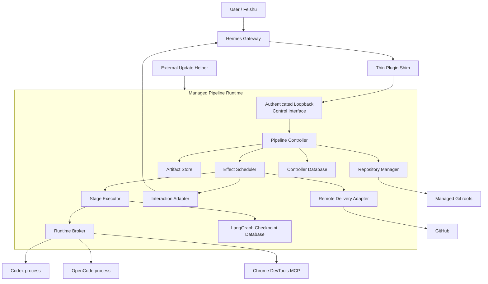
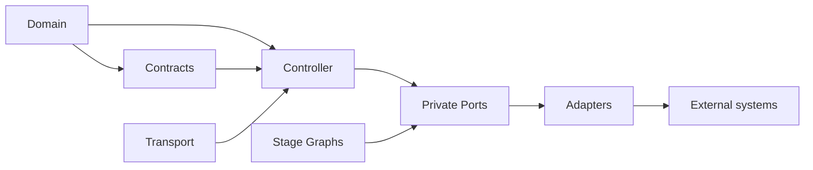

# System and Module Design

This document defines the accepted version 1 process topology, deep Modules, Interfaces, dependency direction, concurrency model, and failure ownership under ADR-0014 through ADR-0025. Phase 00 feasibility evidence may trigger a superseding ADR; it cannot silently change this design.

## Process topology



### Hermes process

The Hermes process loads only the Thin Plugin Shim. The Shim:

- implements `register(ctx)`;
- registers high-level Prod Main tools, operator CLI commands, and lifecycle hooks;
- intercepts plugin-owned Feishu synthetic card commands through `pre_gateway_dispatch`;
- discovers and authenticates the local Control Interface;
- contains no business state, LangGraph graph, database connection, Agent executor, or remote Git credential;
- returns an explicit unavailable result when the managed runtime is unhealthy.

### Managed Pipeline Runtime

One Managed Pipeline Runtime belongs to one Hermes profile/Workspace. It owns:

- the single active Pipeline Controller writer;
- Control Interface and health endpoints;
- background Effect scheduling and reconciliation;
- Agent and browser child-process supervision;
- Controller and checkpoint databases;
- Artifact Store and managed Git roots;
- GitHub polling and Feishu outbound delivery.

Two runtimes may not claim the same Workspace state directory. Startup acquires an operating-system file lock plus a database lease; failure to acquire either is terminal.

### Execution processes

Each Execution Run uses a new supervised process group. The Runtime Broker:

- starts the exact executable and version declared in the Run;
- supplies the immutable Context Manifest and capability configuration;
- captures structured stdout, stderr, exit status, resource use, and cancellation;
- terminates the entire process group on authorized force cancellation;
- never treats process exit alone as a successful Stage result.

### External Update Helper

The Update Helper is installed outside the plugin checkout and Managed Pipeline Runtime. It stages a complete replacement runtime, drains the Controller, verifies migrations and health, switches the active version descriptor, and restores Last Known Good on failure.

## Dependency direction



Rules:

1. `domain` imports only the Python standard library and contract value types.
2. `controller` imports domain and its private ports, never FastAPI, LangGraph, SQLAlchemy, provider SDKs, subprocess, or concrete filesystem code.
3. `contracts` owns versioned wire models and Schema generation; it contains no orchestration logic.
4. `stage_executor` may use LangGraph but reaches business state only through the Controller Interface.
5. Adapters depend inward on Interfaces; core Modules never import Adapters.
6. Transport code authenticates and translates requests, then calls Controller; it does not reproduce authorization or transition rules.
7. Cross-Module calls use typed values rather than dictionaries except at serialization seams.
8. No package imports the root Hermes plugin Shim.

These rules are enforced by architecture tests.

## Deep Modules

### Pipeline Controller

External Interface:

```python
submit(command: ControllerCommand) -> CommandReceipt
read(query: AuthorizedPipelineQuery) -> PipelineView
```

The Controller hides authentication decisions, authorization, deduplication, revision checks, aggregate transitions, Event append, projection updates, Outbox creation, approval staleness, lease/fencing validation, retry budgets, and audit receipts.

Interface invariants:

- `submit` is the only business mutation Interface;
- the same `command_id` and payload returns the original receipt;
- the same `command_id` with a different payload returns `COMMAND_ID_CONFLICT`;
- a rejected Command cannot append a state-transition Event;
- accepted Events, projections, Outbox Effects, and receipt commit atomically;
- a stale expected revision never silently retries semantic intent;
- `read` enforces Project authorization and sensitivity filtering.

### Stage Executor

External Interface:

```python
start(execution_input: ExecutionInput) -> ExecutionHandle
resume(resume_input: ResumeInput) -> ExecutionHandle
cancel(cancel_request: ExecutionCancelRequest) -> CancelReceipt
inspect(run_id: ExecutionRunId) -> ExecutionSnapshot
```

The Module hides LangGraph construction, checkpoint configuration, Stage node sequencing, Controller receipt persistence, Run result validation, and graceful interruption.

Production uses a LangGraph Adapter. Tests use a deterministic in-memory Adapter. Callers cannot access graph state or nodes directly.

### Runtime Broker

External Interface:

```python
launch(request: RuntimeLaunchRequest) -> RuntimeHandle
signal(request: RuntimeSignalRequest) -> RuntimeSignalReceipt
inspect(runtime_id: RuntimeId) -> RuntimeSnapshot
collect(runtime_id: RuntimeId) -> RuntimeOutcome
```

The Module hides executable discovery, version verification, environment assembly, capability enforcement, process groups, structured stream parsing, timeouts, resource accounting, and cleanup.

Codex, OpenCode, browser, and fake implementations are Adapters behind this Interface; vendor-specific output never enters the Controller domain.

### Artifact Store

External Interface:

```python
put(request: ArtifactPutRequest) -> ArtifactManifest
open(request: AuthorizedArtifactOpen) -> BinaryIO
verify(artifact_id: ArtifactId) -> ArtifactVerification
```

The Module hides canonical hashing, atomic file placement, deduplication, encryption hooks, sensitivity policy, retention, and integrity verification. Callers cannot address an artifact by mutable path.

### Repository Manager

External Interface:

```python
prepare(request: RepositoryPreparation) -> SourceView
create_candidate(request: CandidateRequest) -> CandidateManifest
verify(request: RepositoryVerification) -> RepositoryVerificationResult
cleanup(request: RepositoryCleanup) -> CleanupReceipt
```

The Module hides mirror management, worktree creation, safe path resolution, immutable snapshots, Git command construction, metadata protection, Candidate commits, symlink/submodule policy, and proven-owned cleanup.

Agents never receive this Interface. The Controller invokes it through Outbox Effects.

### Remote Delivery

External Interface:

```python
publish(request: DeliveryRequest) -> DeliveryReceipt
reconcile(request: DeliveryReconcileRequest) -> DeliverySnapshot
```

The Module hides GitHub App authentication, remote compare-and-swap, namespaced branches, single-PR identity, conditional polling, review/check/merge-queue normalization, and provider rate limits.

The Interface provides no approve, merge, force-push, protection, workflow, or secret operation.

### Interaction

External Interface:

```python
deliver(request: InteractionRequest) -> InteractionReceipt
ingest(event: InteractionEvent) -> ControllerCommand
```

The Module hides Feishu card rendering, CLI fallback, destination selection, transport retries, card versioning, actor/provider identity extraction, and stale-action rejection inputs.

Inbound events still pass Controller authentication and authorization. An Interaction Adapter cannot accept an approval itself.

### Operations

External Interface:

```python
health() -> HealthReport
reconcile(request: ReconcileRequest) -> ReconcileReport
backup(request: BackupRequest) -> BackupManifest
restore(request: RestoreRequest) -> RestoreReceipt
```

The Module hides database checks, runtime inventory, worktree reconciliation, provider refresh, Outbox repair, backup consistency, restore validation, and maintenance mode.

Restore is unavailable while the normal Controller writer is active.

## Internal persistence ports

Persistence ports are private to the owning deep Module. They are not re-exported as a repository-wide abstraction.

Required production/test pairs:

| Private port | Production Adapter | Test Adapter |
| --- | --- | --- |
| Controller transaction store | SQLite/SQLAlchemy Core | in-memory deterministic store |
| Checkpoint store | LangGraph SQLite saver | LangGraph memory saver |
| Binary artifact backend | local CAS filesystem | in-memory bytes backend |
| Git execution | explicit system Git binary | fixture repository Adapter |
| Clock | monotonic/wall system clock pair | manual clock |
| Identity provider | Hermes/Feishu/GitHub identities | deterministic identity fixture |

No generic repository, storage, provider, or manager base class is created until both implementations exercise the same real Interface.

## Control Interface

The loopback HTTP surface is deliberately small:

| Method and path | Purpose |
| --- | --- |
| `GET /livez` | process liveness only; deliberately unversioned |
| `GET /readyz` | database, migration, lock, and reconciliation readiness; deliberately unversioned |
| `GET /v1/version` | runtime, protocol, contract, and compatibility metadata |
| `POST /v1/commands` | submit one Controller Command |
| `POST /v1/queries/pipeline` | authorized Pipeline projection |
| `POST /v1/queries/inbox` | authorized waiting decisions/questions |
| `POST /v1/operator/reconcile` | explicit administrative reconciliation |

There are no transport-specific transition endpoints such as `/approve`, `/retry`, or `/complete`. Every intent is a versioned Controller Command.

The runtime descriptor contains protocol version, PID, start identity, port, certificate/token generation, active release, and state-directory identity. It is written atomically with owner-only permissions.

## Prod Main tool surface

Prod Main receives high-level tools rather than generic Command construction:

- `pipeline_intake`;
- `pipeline_confirm_requirement`;
- `pipeline_get`;
- `pipeline_list_waiting`;
- `pipeline_submit_decision`;
- `pipeline_control`;
- `pipeline_retry_blocked`;

Each handler derives actor identity from trusted Hermes request context, constructs only an allowed Command type, and submits it through the Shim. Prod Main cannot provide actor IDs, revisions, approval attestations, lease generations, or internal state targets as free-form values.

## Concurrency model

- One Controller Command processor serializes writes per Workspace.
- Different Pipeline aggregates may be evaluated concurrently only before entering the commit lane.
- SQLite write transactions remain short and contain no model, subprocess, filesystem, Git, notification, or network operation.
- Every external operation is an Outbox Effect executed after commit.
- Effect concurrency is limited by effect type, Project, provider, and global resource budgets.
- One Stage Lease generation owns one active Execution Run.
- Read projections may use separate read connections under WAL mode.
- Blocking libraries run outside the Controller event loop with bounded worker pools.

## Startup

1. resolve the Workspace state directory without following unsafe links;
2. acquire process lock;
3. load and validate configuration and secret handles;
4. verify runtime release and protocol compatibility;
5. open Controller database and verify migration state;
6. acquire Controller lease;
7. start the loopback listener and write the runtime descriptor;
8. reconcile projections, Outbox, leases, child processes, worktrees, artifacts, and GitHub state;
9. mark readiness true;
10. begin new Effect dispatch.

No new Stage dispatch occurs before reconciliation completes.

## Shutdown and crash recovery

Graceful shutdown:

1. readiness becomes false;
2. new Commands that require Effects receive a maintenance receipt while safe decisions remain durable;
3. no new Run is launched;
4. active Runs receive graceful checkpoint/cancel according to policy;
5. Outbox receipts and database writes drain;
6. Controller lease and runtime descriptor are released.

After an unclean stop, child processes are not assumed dead and Effects are not assumed failed. Reconciliation proves their identity, lease generation, process start identity, and persisted receipt before resuming, terminating, or redispatching them.

## Failure ownership

| Failure | Owning Module |
| --- | --- |
| invalid transition, stale revision, unauthorized actor | Pipeline Controller |
| graph checkpoint or node replay | Stage Executor |
| CLI crash, malformed JSONL, process timeout | Runtime Broker |
| artifact hash mismatch or missing content | Artifact Store |
| worktree escape, Git metadata damage, Candidate mismatch | Repository Manager |
| GitHub rate limit, remote-head conflict, PR drift | Remote Delivery |
| Feishu delivery failure or duplicate card action | Interaction |
| migration, backup, restore, reconciliation failure | Operations |

An owner reports a typed result; it cannot compensate by changing another Module's state directly.

## Initial package layout

```text
plugin.yaml
__init__.py
pyproject.toml
uv.lock
src/hermes_pipeline/
├── domain/
├── contracts/
├── controller/
├── stage_executor/
├── runtime_broker/
├── artifacts/
├── repository/
├── delivery/
├── interaction/
├── operations/
├── persistence/
├── transport/
└── cli/
schemas/
tests/
├── architecture/
├── domain/
├── contracts/
├── adapters/
├── integration/
├── scenarios/
├── adversarial/
└── agent_eval/
```

Subtree `AGENTS.md` files may narrow test and safety instructions, but they cannot redefine Module Interfaces or accepted ADRs.
