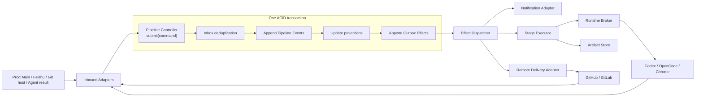

# Controller and Execution Architecture

This document defines the accepted architecture for durable Pipeline control, Stage execution, artifacts, integration delivery, approvals, retries, and cross-cutting lifecycle. Its Module and authority boundaries are technology-neutral; the concrete version 1 implementation selections are governed by ADR-0019 through ADR-0025 and `docs/design/technology-stack.md`.

## Architectural position

The Pipeline Controller is a deep Module with two external operations:

- `submit(command)`: authenticate, authorize, deduplicate, validate, and atomically accept or reject one Controller Command;
- `read(pipeline_id)`: return the current authorized Pipeline projection and references to immutable evidence.

All business transitions pass through `submit`. No Agent, LangGraph node, notification callback, Git provider event, worker, or adapter writes Pipeline state directly.



External delivery is assumed to be at least once. Logical transitions are exactly once through command deduplication, optimistic revision checks, leases, fencing, and idempotent effect consumers.

## Facts, projections, and checkpoints

### Pipeline facts

The append-only Pipeline Event Log is the authoritative business history. Every accepted Controller Command produces one or more schema-versioned Events at a monotonically increasing Pipeline revision.

Mutable Pipeline, Stage, approval, and dashboard tables are rebuildable projections. They are updated in the same transaction as the new Events for efficient reads. Periodic snapshots may accelerate replay but are not independent facts.

Events contain business facts and immutable references, not large transcripts, logs, screenshots, secrets, or mutable filesystem paths.

### Stage execution checkpoints

A Stage workflow engine may persist checkpoints for recovering the internal execution of one Stage Attempt. A checkpoint is not Pipeline truth and cannot authorize a transition.

If LangGraph is selected:

- one `thread_id` belongs to one Execution Run, not the whole Pipeline;
- the graph definition and checkpoint schema versions are pinned on the Execution Run;
- graph state contains identifiers and resumable execution data, not the authoritative Pipeline aggregate;
- a LangGraph `Command` is internal to the Stage Executor and is never treated as a Controller Command;
- business approvals and Git-host events resume the Pipeline only through authenticated Controller Commands;
- deleting or rebuilding a checkpoint may require rerunning an Execution Run, but cannot erase accepted Pipeline Events.

This prevents a dual-source-of-truth design while preserving LangGraph checkpoint, interrupt, task, retry, and replay capabilities.

## Controller transaction protocol

Every inbound message is normalized into an immutable Controller Command with at least:

- globally unique `command_id`;
- `pipeline_id` and command type;
- authenticated actor/provider identity and authorization context;
- `expected_revision`;
- schema and policy versions;
- typed payload;
- source provider and immutable source message, card, webhook, or result ID;
- submission timestamp and trace identity.

Within one database transaction the Controller:

1. inserts or verifies the Inbox record for the source delivery;
2. loads the current projection and compares `expected_revision`;
3. authenticates the actor and evaluates Project policy;
4. validates the transition and referenced artifact versions;
5. appends ordered Pipeline Events;
6. advances the Pipeline revision and projections;
7. appends required Outbox Effects with stable idempotency keys;
8. commits the Inbox result and Command Receipt.

Duplicate commands return the original receipt. A stale revision returns a conflict with the current revision and never silently reapplies intent. Rejections append a security or operational audit record when policy requires it, but do not append a state-transition Event.

An Outbox Effect is identified by:

```text
pipeline_id / event_revision / effect_type / effect_version
```

Workers may deliver an Effect more than once. Adapters must return the same logical result for the same key or expose a conflict; they may not silently create a second Stage, notification, branch, or MR.

## Attempts, runs, leases, and fencing

A Stage Attempt is a logical effort to produce one reviewable Stage result. Infrastructure recovery does not automatically create a new Attempt.

Each Attempt may have multiple Execution Runs:

- a retry after a transient process, network, rate-limit, or host failure creates a new Execution Run under the same Attempt;
- invalid Agent output, test failure, reviewer feedback, or changed semantic input creates a new Attempt;
- every Run records the Stage contract, capability profile, workflow definition, model/tool configuration, input artifact set, and source SHA versions.

Before executing, a worker acquires a time-limited Stage Lease. Every acquisition or takeover increments a monotonically increasing fencing generation. Heartbeats renew only the current generation.

Agent results, checkpoint writes that produce external effects, and completion commands carry the Attempt, Run, lease owner, and fencing generation. Results from an expired or superseded generation are preserved as late evidence but cannot advance the Pipeline.

## Stage Executor seam

The Stage Executor Module hides workflow-engine and CLI-specific behavior behind a small Interface:

- start or resume one versioned Execution Run;
- request graceful cancellation;
- report a typed Run outcome with Artifact references and evidence.

Production may use a LangGraph Adapter; tests use a deterministic in-memory Adapter. Codex, OpenCode, and browser automation are invoked through the Runtime Broker rather than directly by Controller code.

A Stage Executor cannot:

- mutate Pipeline projections or Event rows;
- create or approve a business transition;
- receive remote Git credentials;
- publish an MR or merge code;
- expand its capability profile;
- treat a checkpoint as proof that an external effect occurred.

## Runtime capability model

Every Execution Run receives one immutable, versioned Stage Capability Profile. The profile describes required and prohibited authority across:

- readable and writable filesystem roots;
- Git metadata and permitted read operations;
- executable families and command policy;
- outbound network destinations and protocols;
- environment variables and opaque secret handles;
- browser profile, ports, local services, and test data;
- CPU, memory, disk, process, token, cost, and wall-clock limits;
- permitted external side effects.

Default profiles are:

| Profile | Source access | Network and secrets | Side effects |
| --- | --- | --- | --- |
| `planning-readonly` | Read-only Planning Base snapshot | Documentation allowlist; no repository credentials | Artifact submission only |
| `development-workspace` | Writable Pipeline Managed Worktree; protected Git metadata | Dependency allowlist; scoped test secrets | Local build and self-test only |
| `e2e-browser` | Read-only Integration Candidate source | Test application and approved dependencies; isolated browser credentials | Test data and evidence only |
| `acceptance-readonly` | Read-only Integration Candidate and evidence | Normally none beyond artifact access | Acceptance report only |
| `remote-delivery` | Delivery Package in a clean temporary repository | One registered Git Project with bot credentials | Namespaced branch and MR/PR only |

Prompt instructions are not enforcement. A Runtime Adapter must declare which controls it can enforce. If it cannot satisfy every required hard capability, dispatch fails closed as `UNSUPPORTED_RUNTIME`; the Controller never silently downgrades isolation.

Capability escalation creates a durable request reviewed by Project policy or an authorized human. Approval produces a new profile version and normally a new Execution Run; an Agent cannot widen a live sandbox.

## Artifact and evidence model

All durable outputs are stored outside Managed Worktrees through an Artifact Store Module. Its small Interface stores content, opens authorized content, and verifies identity and integrity.

Every stored object has an immutable Artifact Manifest containing:

- artifact ID, type, and schema version;
- content hash, byte size, and media type;
- producing Pipeline, Stage, Attempt, and Run;
- Planning Base, Candidate, and Integration Candidate SHAs when applicable;
- model, tool, workflow, runtime, and policy versions;
- creation time;
- Project ownership;
- sensitivity, redaction, encryption, retention, and legal-hold class.

Evidence Bundles reference Artifact IDs and hashes. Gates validate the Bundle schema, producer, provenance, Candidate identity, and required evidence types.

Human-readable PRD, design, or report files may be exported into Git for collaboration, but those paths are projections. A mutable path such as `docs/PRD.md` is never the authoritative artifact identity.

Large transcripts and logs are not embedded in Pipeline Events. Secret-bearing raw data is separated from ordinary audit events and is accessible only under Project policy.

## Remote delivery and Git authority

The Controller and Stage Agents keep no remote Git credentials. Remote delivery is a separate Module with provider Adapters such as GitHub App, GitLab bot, and an in-memory test Adapter.

The Controller emits a signed, idempotent Delivery Request referencing a Delivery Package. The package contains the exact Controller-created Candidate commit or a verifiable Git bundle, target Project, expected remote state, target branch, and evidence identity.

The Remote Delivery Adapter:

- is installed only on explicitly registered Projects;
- receives repository-content and MR/PR write permissions only;
- has no administration, workflow-edit, secret-read, approval, merge, force-push, or branch-protection bypass authority;
- owns one namespaced branch per Pipeline;
- imports and verifies the Delivery Package in a clean repository;
- uses compare-and-swap semantics and never overwrites an unexpected remote head;
- creates or updates exactly one MR or PR per Pipeline;
- returns provider IDs and the remote head SHA through a deduplicated polling or delivery result command;
- never approves or merges its own change.

Provider result identities, conditional-poll versions, and any optional webhook signatures are verified at the inbound Adapter. The Git host remains authoritative for reviewer identity, protected-branch status, merge queue outcome, and merged commit identity; the Controller records reconciled provider facts as Events.

## Planning and integration baselines

Source identity is split into:

- **Planning Base SHA**: the immutable commit used by PRD, Architecture, and initial Development;
- **Candidate SHA**: the Controller-created implementation commit derived from the Planning Base;
- **Integration Base SHA**: the current target head against which delivery is being validated;
- **Integration Candidate SHA**: the exact synthetic merge, merge-group, or merge-train commit evaluated for final integration.

Normal target-branch movement never rewrites the Planning Base and does not automatically invalidate the Approved Solution Baseline. The delivery flow:

1. publishes the Candidate on a controlled branch;
2. obtains an Integration Candidate from a Git-host merge queue/train or a trusted integration build;
3. records its Candidate and Integration Base parents;
4. reruns Project-required build, security, E2E, and Acceptance checks against that exact Integration Candidate;
5. repeats when the integration head changes.

Human semantic routing occurs only when policy detects a material conflict, including:

- an unresolvable merge conflict;
- changes to protected API, schema, migration, authorization, security, or workflow paths;
- changed observable acceptance behavior;
- incompatible dependency or threat-model changes;
- evidence that the Approved Solution Baseline is no longer safe or meaningful.

Ordinary drift with successful revalidation remains automatic. Replacing the Planning Base is an exceptional Baseline Refresh that invalidates only artifacts actually derived from the superseded semantic context.

## Approval authority

Solution Baseline Approval is a Hermes business decision. Feishu or another interaction Adapter may collect it, but the Controller validates the assigned Solution Approver, exact artifact set, Project membership, policy version, and stale-action protection.

Final MR or PR approval and merge are Git-host decisions enforced by protected branches, required reviewers, status checks, and optional merge queues. A Feishu button may deep-link or notify, but cannot substitute for repository-native approval.

Every accepted approval creates an immutable attestation containing:

- decision type and scope;
- provider and immutable provider actor ID;
- Project role at decision time;
- exact artifact set or MR/PR head SHA;
- policy version and timestamp;
- source card, message, review, or webhook ID.

Any artifact or head change invalidates a pending approval. Whether a Git host dismisses an already accepted stale review is governed by Project branch policy and recorded by reconciled provider Events.

## Failure and retry taxonomy

Failures are classified before retry:

| Failure class | Controller behavior |
| --- | --- |
| `TRANSIENT_INFRA` | Bounded exponential retry with jitter as a new Execution Run under the same Attempt |
| `RATE_LIMIT_OR_BUDGET_WAIT` | Schedule a bounded retry or pause until quota policy permits |
| `AGENT_PROCESS_LOST` | Resume a safe checkpoint or create a new Run with a higher fencing generation |
| `AGENT_OUTPUT_INVALID` | New Stage Attempt with exact validation feedback |
| `TEST_OR_ACCEPTANCE_FAILURE` | New Development Attempt with evidence |
| `POLICY_DENIED` | Fail closed; require policy change or authorized escalation |
| `SECURITY_VIOLATION` | Revoke lease, preserve evidence, and require security review |
| `HUMAN_WAIT_TIMEOUT` | Remind, escalate, or pause; never auto-approve or auto-reject |
| `NON_RETRYABLE` | Fail or route manually according to Stage policy |

Retry budgets exist per Effect, Execution Run, Stage Attempt, and Pipeline. Exhaustion creates `MANUAL_INTERVENTION_REQUIRED`; it never causes an unlimited paid-model loop.

External effects are at least once and must be idempotent. A model invocation may be repeated only when the policy accepts the cost and semantic implications; an already persisted valid Stage result is reused instead of regenerated.

## Cross-cutting lifecycle

Pipeline work state and operational lifecycle are modeled separately to avoid duplicating every Stage state.

Operational lifecycle values are:

- `OPEN`;
- `PAUSE_REQUESTED`;
- `PAUSED`;
- `CANCEL_REQUESTED`;
- `CANCELLED`;
- `COMPLETED`;
- `FAILED`.

Rules:

1. Pause stops new Effects and asks the current Run to reach a safe checkpoint. Resume creates new leases as needed.
2. Cancel first performs graceful cancellation. After a policy timeout, an authorized force termination revokes the lease, increments fencing, and kills the Runtime; it cannot erase history.
3. A cancelled Pipeline cannot resume. A new Pipeline may be forked from its approved artifacts under a new identity.
4. Human-role reassignment invalidates pending cards and requests but does not rewrite accepted decisions.
5. Agent reassignment always creates a new lease generation and, when semantic context changes, a new Attempt.
6. Human waits have reminder and escalation schedules; they never auto-approve.
7. Cleanup is an idempotent Outbox Effect restricted to proven Pipeline-owned paths and retention policy.
8. Controller restart reconciles Inbox, Event Log, projections, Outbox, leases, Runtime inventory, worktrees, and Git-provider state before new dispatch.
9. In-flight Pipelines remain pinned to their Controller policy, Stage contract, workflow definition, and artifact schemas until an explicit compatible migration Event.

## Non-negotiable invariants

1. The Pipeline Event Log is the sole authoritative business history.
2. LangGraph or another workflow engine is a replaceable Stage Executor implementation, not a second Pipeline authority.
3. One transaction accepts a Command, appends Events, updates projections, and appends Effects.
4. No external effect is assumed exactly once.
5. A stale revision, artifact version, lease generation, approval, Candidate, or integration head cannot advance the Pipeline.
6. Worktree isolation never substitutes for runtime capability enforcement.
7. Durable artifacts are addressed by immutable identity and hash, never only by path.
8. Agents and the Controller hold no remote Git credential or merge authority.
9. Normal target drift triggers integration revalidation, not automatic product replanning.
10. Human approval is required only at policy-defined semantic or repository authority boundaries.

## Technology decisions tracked separately

This technology-neutral architecture intentionally does not select:

- the Controller database and migration library;
- the Outbox dispatcher or queue product;
- the LangGraph checkpointer backend;
- the API and Dashboard framework;
- the sandbox and process-isolation implementation;
- the Artifact Store backend;
- GitHub or GitLab as the first delivery provider;
- single-process, local-service, or distributed deployment topology.

The accepted version 1 stack is maintained in `docs/design/technology-stack.md`. LangGraph is the Stage Executor implementation under ADR-0023, but that choice must preserve every invariant above and cannot move Pipeline authority into graph state.
