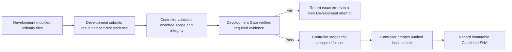

# Git Isolation and Protection

This document defines the accepted Git trust boundary and integration-delivery extensions under ADR-0013, ADR-0017, and ADR-0018. Product-specific retention and advanced repository-feature policy remain Phase-owned decisions.

## Trust boundary

Every Pipeline receives one Managed Worktree created and governed by the Pipeline Controller for its writable Development lifecycle. PRD and Architecture receive controlled read-only source views at the immutable Planning Base SHA; E2E and Acceptance receive clean short-lived Verification Sandboxes at the exact Integration Candidate SHA. No Pipeline Agent executes in or modifies a Project Member's working copy.

Agents are untrusted Git clients. Prompt instructions are not the security control: filesystem scope, process policy, credential isolation, post-execution validation, and Controller-owned Git operations enforce the boundary.

## Authority matrix

| Operation | Pipeline Agent | Pipeline Controller |
|---|---:|---:|
| Read tracked files in assigned source view | Allowed by Stage policy | Allowed |
| Modify ordinary files | Development only | Validation and repair only |
| `status`, `diff`, `log`, `show`, `grep`, `ls-files` | Allowed through the read-only command policy | Allowed |
| Create or remove worktrees | Denied | Allowed within managed roots |
| Create or move local Pipeline branches | Denied | Allowed for Pipeline lifecycle |
| Update the Git index | Denied | Allowed after Gate validation |
| Create Candidate commits | Denied | Allowed after Gate validation |
| Checkout, reset, clean, merge, or rebase | Denied | Denied except a future explicitly approved lifecycle operation |
| Fetch, push, or modify remotes | Denied | Denied in version 1 |
| Create tags | Denied | Denied in version 1 |
| Modify `.git` metadata or worktree pointers | Denied | Allowed only through the managed Git implementation |

PRD, Architecture, E2E, and Acceptance roles are read-only with respect to Project source. Development may change ordinary files in its Pipeline's Managed Worktree but cannot stage or commit them.

## Isolation topology

```text
repository-mirror/                  Controller-owned Git object source
pipelines/PIPE-0042/
└── development/                    persistent writable Managed Worktree

runs/PIPE-0042/
├── e2e-attempt-003/                short-lived Verification Sandbox
└── acceptance-attempt-002/         short-lived Verification Sandbox
```

Fresh LLM context and fresh filesystem state are separate controls. PRD and Architecture always use independent Codex sessions, but they do not receive long-lived writable worktrees merely because they are different roles.

A linked worktree isolates writable checkout state; it is not a confidentiality or process-security boundary. Linked worktrees still share the repository's object database, refs, and normally its Git configuration. Read access, write scope, credentials, network capability, and process isolation are therefore governed separately.

The Controller creates an additional worktree or checkout only when at least one condition holds:

- two writable Agents or Pipelines must operate concurrently;
- multiple Candidate variants must coexist;
- an untrusted execution needs filesystem-level isolation;
- Project policy requires exact attempt preservation for forensic review.

Development retries reuse the Pipeline's Managed Worktree after integrity reconciliation, allowing a new OpenCode session to continue incomplete changes. Each E2E and Acceptance execution starts with clean processes, ports, browser state, caches, test data, environment variables, and an exact Integration Candidate SHA; a new directory alone is not sufficient runtime isolation.

## Candidate creation



The Candidate SHA is never accepted from Agent output. Agent output may describe expected changes, but the Controller derives the authoritative commit identity from its own successful commit operation.

Before committing, the Controller verifies at least:

- the worktree belongs to the expected Project and Pipeline;
- Git metadata and worktree pointers are intact;
- all changes are inside the assigned worktree and permitted path scope;
- no forbidden symlink, special file, unexpected submodule change, oversized artifact, or secret is included;
- the submitted Stage and attempt identities match;
- required self-test evidence belongs to the current file state;
- no remote or protected branch was modified.

## Planning and integration baselines

At Pipeline creation, the Controller resolves the selected target reference to an exact commit and records it as the immutable Planning Base SHA. PRD, Architecture, and Development record this identity, and the Controller-created Candidate is derived from it.

Before integration verification, the Remote Delivery Adapter publishes the Candidate to a namespaced branch without exposing remote credentials to the Controller or Agents. A trusted provider merge queue/train or integration builder combines the Candidate with the current target head and returns:

- the Integration Base SHA;
- the exact Integration Candidate SHA;
- both parent identities and provider evidence.

E2E, Acceptance, and Project-required final checks bind to the Integration Candidate SHA. If the target or merge-group head moves, the Controller creates a new Integration Candidate and automatically revalidates it. Previous evidence remains auditable but cannot authorize the new head.

Ordinary drift never rewrites the Planning Base and does not require routine human approval. A human Baseline Refresh Request is raised only when a material semantic conflict means the approved solution may no longer be valid. The authorized decisions are:

- `KEEP_PLANNING_BASE`: preserve the approved semantics and continue with recorded human direction;
- `REFRESH_PLANNING_BASE`: select a new Planning Base version and invalidate only the downstream artifacts, approvals, Candidates, and evidence derived from superseded semantic inputs;
- `CANCEL_PIPELINE`: stop further execution while preserving the complete audit history.

A refresh is a new auditable baseline version, not a mutation of history. Results arriving late from superseded Planning or Integration identities cannot advance the Pipeline.

## Agent process restrictions

Agent runtimes receive no Git remote credentials. Git-mutating commands are denied by command policy, and `.git` metadata is protected by filesystem permissions where the host supports them.

Allowed Git reads use explicit binaries and arguments rather than user aliases. Repository-local hooks and configuration cannot acquire Controller authority; Pipeline quality checks are explicit Gates.

An Agent attempt that changes Git metadata, escapes the worktree, invokes a denied Git operation, or leaves an unexplainable repository state fails closed and produces a security audit event.

## Controller restrictions

Controller authority is narrow, local, and auditable. It may perform only the Git mutations required to create, validate, commit, retain, and remove Pipeline-owned worktrees, verification checkouts, and branches.

The Controller does not:

- push to a remote;
- merge into a user or protected branch;
- rebase a Pipeline branch;
- rewrite existing commit history;
- create release tags;
- discard a user's working-copy changes;
- operate on a worktree it does not own.

Every Controller-created commit records the Pipeline, Stage, attempt, source baseline, and evidence identity in the Pipeline audit record. Commit-message and author conventions will be defined with the delivery model.

The separately deployed Remote Delivery Adapter may push only its Pipeline-namespaced branch and create or update exactly one MR or PR using least-privilege provider credentials. It cannot approve, merge, force-push, alter protection, edit workflows, or read repository secrets. The Git host is authoritative for reviewer identity, protected-branch state, merge-queue outcome, and final merged commit.

## Recovery invariants

1. A missing or corrupt Managed Worktree never causes fallback to the User Working Copy.
2. A Candidate SHA is recorded only after the local commit exists and passes integrity checks.
3. A repeated completion event cannot create multiple authoritative Candidates for the same successful attempt.
4. A failed commit leaves the attempt incomplete and recoverable.
5. Controller restart reconciles managed worktree records with actual Git state before dispatching another Agent.
6. Cleanup removes only paths proven to belong to the relevant Pipeline.

## Project-policy decisions still required

- Pipeline branch naming and collision handling;
- behavior for submodules, Git LFS, sparse checkout, and very large repositories;
- retention and cleanup after completion, cancellation, and failure;
- exact GitHub App installation, repository selection, branch prefix, and retention policy for the Phase 5 Project configuration.

GitHub is the first provider Adapter under ADR-0025. Adding GitLab requires a later Adapter Slice and does not reopen the Git authority boundary.
