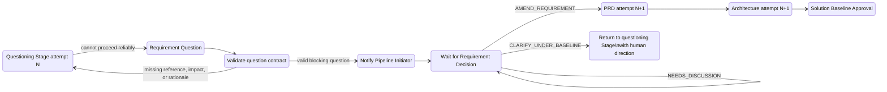
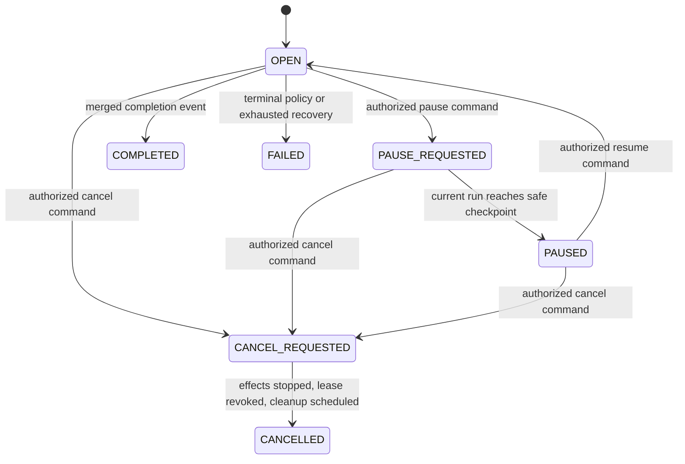

# Production Pipeline State Machine

This document defines the accepted version 1 responsibility and allowed-transition model. Transport details such as Feishu cards and repository MR or PR adapters are not sources of truth.

## Core invariant

Agents may submit artifacts, evidence, recommendations, and questions. They may not approve their own work, invalidate a human-approved baseline, select a semantic rework destination, merge code, or change Pipeline state.

Only the Pipeline Controller changes state. Deterministic Gates validate machine-verifiable facts. The standard policy schedules human approval only at the complete solution baseline and final merge boundaries; ambiguous intent, elevated risk, material baseline conflict, exhausted retries, or conflicting evidence cause conditional human intervention.

## Main state machine

```mermaid
stateDiagram-v2
    direction LR

    state "Create Pipeline\nconfirmed requirement input" as CREATED

    state "Codex PRD\nfresh session · attempt N" as PRD
    state "PRD Gate\nautomatic contract checks" as PRD_GATE

    state "Codex Architecture\nfresh session · attempt N" as ARCH
    state "Design Gate\nautomatic contract checks" as DESIGN_GATE
    state "Requirement Decision\nPipeline Initiator" as REQUIREMENT_DECISION
    state "Solution Baseline Approval\nPRD + design + test plan" as SOLUTION_APPROVAL

    state "OpenCode Development\nimplementation + self-test" as DEV
    state "Development Gate\nevidence + Candidate SHA" as DEV_GATE
    state "Remote Delivery\nbranch + MR/PR" as DELIVERY
    state "Integration Preparation\ncurrent target + exact merge candidate" as INTEGRATION

    state "OpenCode E2E\nfresh session + clean sandbox + Chrome MCP" as E2E
    state "E2E Gate\nindependent evidence" as E2E_GATE

    state "Codex Acceptance\nfresh session + clean sandbox" as ACCEPT
    state "Acceptance Gate\ncriteria + evidence + SHA" as ACCEPT_GATE

    state "Solution Baseline Decision\nSolution Approver" as SOLUTION_DECISION
    state "MR Review and Merge\nMerge Approver" as MERGE_APPROVAL
    state "Infrastructure Blocked" as INFRA_BLOCKED
    state "Completed" as COMPLETED

    [*] --> CREATED
    CREATED --> PRD

    PRD --> PRD_GATE: submit PRD attempt
    PRD_GATE --> PRD: invalid artifact or evidence
    PRD_GATE --> ARCH: checks pass

    ARCH --> DESIGN_GATE: submit design and test plan
    DESIGN_GATE --> ARCH: invalid artifact or evidence
    DESIGN_GATE --> SOLUTION_APPROVAL: checks pass
    DESIGN_GATE --> REQUIREMENT_DECISION: valid Requirement Question

    REQUIREMENT_DECISION --> PRD: amend product intent\nfeedback → PRD attempt N+1
    REQUIREMENT_DECISION --> ARCH: clarify architecture\nArchitecture Direction → attempt N+1
    REQUIREMENT_DECISION --> REQUIREMENT_DECISION: further discussion required

    SOLUTION_APPROVAL --> PRD: request requirement changes
    SOLUTION_APPROVAL --> ARCH: request design or test-plan changes
    SOLUTION_APPROVAL --> DEV: approve\nlock Approved Solution Baseline

    DEV --> DEV_GATE: submit implementation and self-test
    DEV_GATE --> DEV: self-test or evidence fails
    DEV_GATE --> DELIVERY: pass\nlock Candidate SHA
    DELIVERY --> INTEGRATION: verified remote head
    INTEGRATION --> E2E: create Integration Candidate SHA
    INTEGRATION --> SOLUTION_DECISION: material semantic conflict
    INTEGRATION --> INFRA_BLOCKED: provider or environment failure

    E2E --> E2E_GATE: submit test report
    E2E_GATE --> DEV: fail\ntest evidence → Development attempt N+1
    E2E_GATE --> ACCEPT: pass\nIntegration Candidate unchanged
    E2E_GATE --> INFRA_BLOCKED: environment failure

    ACCEPT --> ACCEPT_GATE: submit acceptance report
    ACCEPT_GATE --> MERGE_APPROVAL: pass\nexact integration head verified
    ACCEPT_GATE --> DEV: reject · implementation defect
    ACCEPT_GATE --> SOLUTION_DECISION: question Approved Solution Baseline
    ACCEPT_GATE --> INFRA_BLOCKED: environment failure

    SOLUTION_DECISION --> ARCH: confirm design or test-plan rework
    SOLUTION_DECISION --> DEV: classify as implementation defect
    SOLUTION_DECISION --> ACCEPT: uphold baseline\nre-evaluate with human direction
    SOLUTION_DECISION --> INTEGRATION: uphold baseline\nrebuild integration candidate
    SOLUTION_DECISION --> REQUIREMENT_DECISION: escalate to product intent

    MERGE_APPROVAL --> DEV: request implementation changes
    MERGE_APPROVAL --> SOLUTION_DECISION: challenge solution baseline
    MERGE_APPROVAL --> REQUIREMENT_DECISION: challenge product intent
    MERGE_APPROVAL --> COMPLETED: exact reviewed head merged by authorized human
    MERGE_APPROVAL --> INTEGRATION: target or merge-group head changed

    INFRA_BLOCKED --> INTEGRATION: recover originating integration preparation
    INFRA_BLOCKED --> E2E: recover originating E2E Stage
    INFRA_BLOCKED --> ACCEPT: recover originating Acceptance Stage

    COMPLETED --> [*]
```

Every backward transition creates a new Stage attempt. It never resumes an old hidden conversation. A new attempt receives the confirmed input, current approved baselines, previous artifacts, verified evidence, and exact human or Gate feedback that caused the transition.

The Pipeline Controller does not gain remote push or merge authority from this state machine. A separately constrained Remote Delivery Adapter publishes the verified Candidate to a namespaced branch and creates or updates one MR or PR. Repository-native protection and an authorized human perform the final approval and merge.

Ordinary target movement creates a new Integration Base and Integration Candidate, then reruns the Project-required checks. It does not reopen the Planning Base or require a human click. Only a detected material semantic conflict is routed to a human for baseline-impact classification.

## Requirement Question flow

Architecture may raise a Requirement Question before Solution Baseline Approval when the current PRD leaves a decision that materially affects design or testability. Any downstream Agent may raise one after approval when it discovers evidence that product intent cannot be applied reliably. Raising the question does not establish that the PRD or Approved Solution Baseline is wrong.

### Human decisions

| Decision | Meaning | Destination |
|---|---|---|
| `AMEND_REQUIREMENT` | The question exposes missing, contradictory, or changed product intent. | New PRD and Architecture attempts followed by a new Solution Baseline Approval. |
| `CLARIFY_UNDER_BASELINE` | Product intent remains unchanged and the human supplies an authoritative direction. | A new attempt of the questioning Stage with the direction attached. |
| `NEEDS_DISCUSSION` | The responsible human cannot yet make a reliable decision. | Remain waiting without modifying the baseline. |

If a human answer changes externally observable behavior or acceptance criteria, it must use `AMEND_REQUIREMENT`. `CLARIFY_UNDER_BASELINE` is only for direction that leaves the approved semantics unchanged.

## Question contract

A blocking Requirement Question must identify:

- the exact input or Approved Solution Baseline references;
- the concrete question, without declaring the baseline defective;
- why the Agent cannot proceed reliably under the current text;
- the impact on design, testing, compatibility, risk, or acceptance;
- reasonable options and an explicitly non-binding recommendation;
- whether the question is blocking.

Equivalent open questions are deduplicated. A non-blocking uncertainty becomes an explicit assumption in the next Solution Baseline Approval package instead of stopping the Pipeline.

## Routine and conditional human intervention

The standard policy has two scheduled human boundaries:

1. Solution Baseline Approval before Development.
2. Merge Approval after automated E2E and Codex Acceptance pass.

Additional human intervention is conditional, including:

- a valid Requirement Question;
- security, permission, migration, compatibility, or irreversible-cost escalation;
- a material semantic conflict that may require a Baseline Refresh Request;
- automatic retry-budget exhaustion;
- conflicting E2E and Acceptance evidence;
- a request for credentials, external-system access, or broader authority;
- an optional protected-environment deployment policy.

Self-test, E2E, static checks, artifact validation, and Codex Acceptance remain automatic Gates and do not require routine human clicks.

## Cross-cutting operational lifecycle

Work Stage and operational lifecycle are separate state dimensions:

`PAUSE_REQUESTED` prevents new effects and asks the current Execution Run to checkpoint safely. Cancellation first requests graceful termination, then may revoke the Stage Lease and advance its fencing generation. A cancelled Pipeline cannot resume; later work forks a new Pipeline with explicit provenance. Actor reassignment, timeouts, budget exhaustion, recovery, and cleanup are Controller Commands and Pipeline Events rather than hidden worker behavior.

## Human feedback delivery

Human feedback is a durable artifact associated with the exact Pipeline, Stage, attempt, reviewer, decision scope, and source artifact versions. Prod Main may facilitate the conversation, but it may not paraphrase feedback as the authoritative input.

The preferred interaction is a direct Feishu card for the responsible human, with a non-sensitive status update in the originating thread. Card actions are authenticated against the assigned human and exact artifact or Candidate version. Notification delivery uses a retryable outbox; transport failure cannot alter or bypass the state machine.

## Invariants

1. No Agent may directly transition the Pipeline or approve its own output.
2. No automatic Gate may decide product or design semantics.
3. PRD and Architecture remain independent Codex Stages and fresh sessions.
4. Architecture begins after the automatic PRD Gate, not a separate routine PRD approval.
5. Development requires an Approved Solution Baseline covering the PRD, design, and test plan.
6. Any semantic change to an Approved Solution Baseline requires a new Solution Baseline Approval.
7. Every rework transition creates a preserved new attempt.
8. Every E2E and Acceptance execution uses a fresh session and clean Verification Sandbox.
9. Acceptance and E2E evaluate the same locked Integration Candidate SHA.
10. Any change to the integration head invalidates prior integration evidence and triggers automatic revalidation.
11. Completion requires the exact verified MR or PR head to be merged by an authorized human under Git-host protection.
12. Notification and repository transports are never the source of Pipeline truth.
