# Source Installation and Safe Update

This document defines how the plugin is installed from Git, how installed instances discover releases, and how production updates are applied without corrupting active Pipelines.

## Installation contract

The repository root is a valid Hermes plugin containing `plugin.yaml` and `__init__.py`. A normal installation uses:

```text
hermes plugins install Frisk239/hermes-software-pipeline --enable
hermes pipeline setup
hermes pipeline doctor
hermes gateway restart
```

Hermes clones the default branch into `~/.hermes/plugins/<plugin-name>/`, prompts for manifest-declared environment variables, updates `plugins.enabled`, and asks for a Gateway restart. Git installation alone does not create the Workspace, initialize Pipeline storage, configure role runtimes, register Projects, or start the durable Controller; those are idempotent `hermes pipeline setup` responsibilities.

The plugin checkout contains executable code only. Durable state and user overrides live outside it:

```text
~/.hermes/software-pipeline/
├── config.yaml
├── state.db
├── logs/
├── controller/
├── runtimes/
├── updater/
├── updates/
│   ├── staging/
│   └── backups/
└── last-known-good.json
```

Updating or removing the Git checkout must not delete Pipeline state. Purging durable state is a separate, explicit, confirmed operation.

## Release branches

The repository default branch must always be safe for production source installation:

```text
main       integrated review-gated source
feature/*  short-lived development branches targeting main
release/*  optional stabilization branches targeting main
signed tag immutable stable release identity
```

Direct pushes to `main` are prohibited. Development changes reach `main` only through reviewed Pull Requests. A `main` commit becomes installable only after the complete Release Gate succeeds and the exact commit receives a signed semantic-version tag and release manifest.

CI success on a development commit does not make it an installed update. An update becomes available only when a stable release has been published.

## Update policy

```yaml
updates:
  channel: stable
  mode: notify
  check_interval_hours: 24
  maintenance_window: "02:00-05:00"
```

Supported modes:

| Mode | Detection | Application |
|---|---|---|
| `off` | Disabled | Never |
| `notify` | Automatic | Workspace Administrator approval |
| `auto_patch` | Automatic | Eligible stable patch releases may apply automatically |

`notify` is the default. Minor, major, and high-risk migration releases always require explicit Workspace Administrator approval, regardless of mode.

Update detection may run at Gateway startup, on a fixed interval, or on an administrator request. Detection is read-only and never changes the installed checkout.

## Release manifest

Every stable release publishes machine-readable metadata containing at least:

```yaml
version: 1.2.3
channel: stable
commit_sha: "<full Git SHA>"
tag: v1.2.3
minimum_hermes_version: "<version>"
maximum_hermes_version: "<version or empty>"
minimum_state_schema: 4
target_state_schema: 5
high_risk_migration: false
security_release: false
```

The installed updater accepts releases only from the configured Git origin and verifies the tag, commit, compatibility metadata, and published checksums or signatures.

## Update eligibility

An update may be applied only when all conditions hold:

1. The release belongs to the configured channel.
2. Its tag and commit identity are verified.
3. Required release CI and compatibility metadata are present.
4. The current Hermes version is supported.
5. A valid state-schema migration path exists.
6. The installed checkout is clean and has the expected origin.
7. The Controller has entered drain mode.
8. No Stage executor is running.
9. The maintenance policy permits application now.
10. Configuration and state backups have completed.
11. Staged installation and migration preflight checks pass.

A Pipeline waiting for human review does not block an update. A running Codex, OpenCode, E2E, or Acceptance Stage does.

## Update sequence

```mermaid
flowchart LR
    A["Detect stable release"] --> B["Verify manifest, tag, SHA, and compatibility"]
    B --> C["Enter Controller drain"]
    C --> D["Wait for running Stages"]
    D --> E["Clone exact release into staging"]
    E --> F["Run source-install and migration preflight"]
    F --> G["Back up code, configuration, and state"]
    G --> H["Stop Gateway and Controller"]
    H --> I["Switch staged checkout into place"]
    I --> J["Run forward migration"]
    J --> K["Restart Gateway and Controller"]
    K --> L["Run health and reconciliation checks"]
    L -->|Pass| M["Record Last Known Good"]
    L -->|Fail| N["Restore code and pre-write state snapshot"]
```



The update helper must live outside the plugin checkout so it cannot replace itself midway through an update. Platform-specific switching occurs only after the Gateway and Controller release handles to the installed directory.

The Hermes-native `hermes plugins update` path is suitable for explicit development or manual maintenance, but it is not the production automatic-update mechanism because it performs an in-place fast-forward pull without staging, drain, migration orchestration, health verification, or rollback.

## Drain behavior

Drain mode:

- refuses to dispatch new Stage attempts;
- allows currently running executors to finish or reach their configured timeout;
- continues accepting durable human decisions and notifications;
- records why dispatch is paused;
- remains recoverable after Controller restart.

If drain cannot complete within the configured limit, the update remains pending. It does not terminate a healthy Agent merely to meet a maintenance window.

## Migrations and rollback

Migrations are:

- versioned;
- idempotent;
- forward-only during normal operation;
- tested from every supported previous stable schema;
- performed only while Stage dispatch is drained;
- preceded by a consistent state snapshot.

The new Controller must pass startup and reconciliation health checks before Stage dispatch resumes. If failure occurs before the new version performs Pipeline writes, the updater restores the previous checkout and state snapshot. Migrations that make safe automatic restoration impossible are marked high-risk and require explicit administrator approval with a documented recovery procedure.

An installed version must understand in-flight records and result contracts produced by the supported previous stable version. Updates do not abandon or silently recreate existing Pipelines.

## Local modifications

Automatic update refuses a dirty plugin checkout. User customization belongs in durable configuration and override directories, never as edits under `~/.hermes/plugins/<plugin-name>/`.

The updater reports the blocking paths and leaves the installation unchanged. It never resets or discards local files.

## Version policy

| Change | Version | Default update treatment |
|---|---|---|
| Backward-compatible defect fix | Patch | Eligible for opt-in automatic update |
| New optional capability or compatible migration | Minor | Administrator approval |
| State-machine, configuration, or compatibility break | Major | Administrator approval and migration review |
| High-risk migration in any release | Any | Administrator approval |
| Development commit | None | Never offered to production |

## Failure invariants

1. Update failure cannot advance a Pipeline.
2. A release is never applied while a Stage executor is running.
3. Notification of an update never implies approval to apply it.
4. A dirty checkout is never overwritten.
5. The current code, target code, and Last Known Good commit are always identifiable.
6. Durable state is never stored only inside the plugin checkout.
7. Stage dispatch resumes only after migration, health, and reconciliation checks pass.
