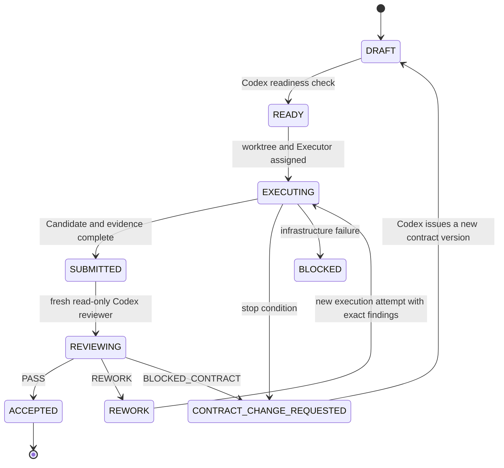

# Phase and Slice Engineering Operating Model

This document governs development of Hermes Software Pipeline itself. It is separate from the production Pipeline that the plugin will eventually provide to its users.

Engineering **Phase**, **Slice**, **Execution Attempt**, and **Review Attempt** must never be stored or displayed as runtime Pipeline **Stage**, **Stage Attempt**, or **Execution Run**. They are two different state systems.

The intended collaboration is:

```text
Human Product Owner
        ↓ approves Phase intent and material changes
Codex Planner-Designer-Reviewer
        ↓ plans, designs, and reviews; does not silently become the implementer
Independent Executor Agent
        ↓ edits only the assigned worktree and returns evidence
Codex Planner-Designer-Reviewer
        ↓ accepts, requests rework, or blocks
Git Custodian / protected repository workflow
        ↓ records accepted Candidate and controls merge
```

Chat history is never the source of engineering truth. Plans, context, results, review findings, and closeouts are versioned repository artifacts.

## Planning horizons

The project uses three planning horizons:

| Horizon | Purpose | Detail level |
| --- | --- | --- |
| Roadmap | Order major product capabilities and dependencies | Outcomes and Phase exit conditions only |
| Phase Plan | Define one coherent engineering capability and all expected Slices | Slice names, dependencies, demonstrations, and Phase Gate |
| Slice Plan | Give one Executor a bounded, independently reviewable work order | Exact Must/Out scope, interfaces, paths, tests, and evidence |

Codex creates the complete Slice map when a Phase begins, but expands only the next ready Slice into an execution-grade plan. Later Slices may be reordered or rewritten after accepted evidence changes the codebase. This avoids both improvisation and a brittle up-front task list.

## Phase contract

A Phase is a coherent capability boundary, not a calendar period. It normally contains three to eight Slices and must leave the repository in an integrated, supportable state.

Every `PHASE.md` contains:

- Phase ID, title, status, owner, and Phase Base SHA;
- user or operator outcome;
- prerequisites and accepted ADRs;
- capability and Module boundaries affected;
- ordered Slice map with dependencies;
- cross-Slice invariants;
- Phase-level test, migration, security, documentation, and demonstration requirements;
- explicit exclusions;
- risks and stop conditions;
- Phase Gate and completion evidence.

A Phase cannot enter execution while required architectural or technology decisions are still marked `proposed`, unless the Phase is explicitly a time-boxed feasibility Phase whose output is that decision.

## Slice contract

A Slice is a thick vertical cut that produces one observable path or one decisive feasibility result. It is not a layer-shaped task such as “create database models” with no exercised consumer.

Every `SLICE.md` contains:

- Slice ID, parent Phase, status, and predecessor Slice identities;
- exact Base SHA and assigned Managed Worktree;
- one-sentence operator or developer path;
- Must scope and Out-of-scope list;
- affected Module Interfaces and binding ADRs;
- permitted and prohibited paths;
- data, migration, compatibility, and security implications;
- acceptance criteria in observable terms;
- required automated tests and path-level demonstration;
- exact verification commands;
- required Evidence Bundle;
- known risks, retry budget, and escalation conditions.

A Slice is ready only when an Executor can act without inventing product semantics, architecture, permissions, or acceptance criteria.

Work-in-progress is limited by real dependency and collision risk, not by the Phase boundary. Dependency-ready Slices may execute concurrently when their writable paths, Interfaces, migrations, generated artifacts, and test fixtures do not conflict; each active writable Slice receives its own Managed Worktree. Slices with overlapping authority or an unresolved integration order execute serially.

## Machine contracts

Markdown files are human-readable projections. Before behavior-bearing implementation, versioned JSON Schemas must validate:

- Phase Plan;
- Slice Contract;
- generated Context Manifest;
- Execution Report;
- Evidence Bundle;
- Review Verdict;
- Contract Change Request;
- Slice and Phase Closeout.

Schema validation runs before dispatch and again when results return. Every manifest binds its schema version, document revision, actor/run identity, Base or Candidate SHA, and content hash.

JSON Schema validation is necessary but not sufficient. The contract checker also rejects:

- duplicate Phase, Slice, risk, acceptance-criterion, or command identities;
- missing predecessor or traceability targets;
- Slice dependency cycles, self-dependencies, or dependencies outside the owning Phase;
- an `APPROVED`, `EXECUTING`, `REVIEWING`, or `COMPLETE` Phase without an approved human attestation;
- a `READY` or later Slice whose Base SHA, worktree assignment, predecessors, binding ADRs, or permitted paths are unresolved;
- a binding ADR that is not accepted, or a superseded ADR without its accepted replacement;
- an acceptance criterion whose verification command identity does not exist;
- a content hash that does not match RFC 8785 canonicalization with the hash field absent;
- a Phase exit criterion without Slice ownership and accepted closeout evidence;
- a changed semantic document whose `document_revision` was not incremented.

### Initial repository bootstrap

Before the first repository commit there is no Base SHA from which a normal Phase Plan or Slice Contract can be issued. The only exception is a Repository Governance Owner-authorized documentation baseline containing vocabulary, accepted ADRs, policies, candidate Schemas, and planning documents. It may not add behavior-bearing implementation or claim executable Phase readiness.

The initial baseline commit becomes the Phase 00 Base SHA. From that point onward:

1. the Phase Plan projection binds that SHA;
2. the first Slice Contract is generated and approved normally;
3. Slice 00-03 adopts bootstrap contract candidates into the Pydantic authoring source and establishes deterministic Schema/OpenAPI generation;
4. no behavior-bearing feasibility Slice begins until contract-source drift, fixtures, compatibility, and semantic validation checks pass.

## Repository artifacts

The durable planning layout is:

```text
AGENTS.md
docs/
├── agents/
│   └── roles/
│       ├── planner-reviewer.md
│       └── executor.md
├── roadmap/
│   ├── ROADMAP.md
│   ├── TRACEABILITY.md
│   └── phase-00-foundation/
│       ├── PHASE.md
│       ├── CLOSEOUT.md
│       └── slices/
│           └── 00-01-repository-baseline/
│               ├── SLICE.md
│               ├── EXECUTION.md
│               └── REVIEW.md
└── development/
    ├── phase-and-slice-operating-model.md
    ├── coding-and-test-standard.md
    ├── ci-and-testing.md
    ├── compatibility-targets.md
    └── development-readiness-audit.md
```

`AGENTS.md` is the short repository constitution shared by all coding Agents. Role contracts are separate, versioned inputs selected explicitly by the harness; the project does not depend on unsupported named `AGENTS.<role>.md` discovery behavior.

## Role context

### Codex Planner-Designer-Reviewer

Before Phase planning, Codex loads:

- root `AGENTS.md` and `CONTEXT.md`;
- current Roadmap and previous Phase Closeout;
- accepted ADRs and normative architecture documents;
- relevant research summaries;
- current default-branch SHA and repository health evidence.

Before Slice review, a fresh Codex review context additionally receives:

- exact Slice Plan and Phase Plan;
- Base and Candidate identities;
- Executor Closeout and Evidence Bundle;
- complete diff and changed-file inventory;
- CI, test, migration, security, and demonstration outputs;
- unresolved findings from previous review attempts.

Codex owns Phase decomposition, Slice design, scope quality, Interface consistency, acceptance contracts, review verdicts, Phase integration, and closeout. It does not fix a rejected Candidate inside the review turn; findings normally return to a new Executor attempt.

### Independent Executor Agent

The Executor receives a compact governing context for the assigned Slice:

- root constitution and Executor role contract;
- Phase invariants and exact Slice Plan;
- binding ADRs and relevant Module documentation;
- repository-wide read access and one writable Managed Worktree;
- previous review findings for a rework attempt;
- verification commands and result schema.

The Context Manifest identifies the minimum authoritative inputs and records their digests; it does not hide the rest of the repository or prohibit supplementary read-only discovery. The Executor may inspect any tracked file, but may edit only the contract's permitted paths inside the assigned Managed Worktree. It cannot change the Slice Plan, mark itself accepted, edit review artifacts, weaken tests, change ADR status, push, merge, or operate on the user working copy.

A Managed Worktree is a write-state and concurrency boundary, not a Phase-sized security sandbox. The default unit is one active writable Slice; rework attempts for that Slice reuse it after integrity reconciliation. Sequential Slices may use a newly created clean worktree at their own exact Base SHA, and accepted worktrees are removed after evidence and integration are durable. A Phase does not receive an extra worktree merely because it is a Phase.

### Git Custodian

Git mutation is performed by a deterministic harness or explicitly authorized human. It creates worktrees, validates scope, records Candidate commits, publishes feature branches, and never grants the Executor remote credentials.

## Slice lifecycle



Review has four independent axes:

1. **Spec** — the Candidate satisfies every in-scope acceptance criterion.
2. **Standards** — the implementation follows repository, Interface, migration, security, and test rules.
3. **Evidence** — commands, tests, and demonstrations are reproducible and bound to the Candidate.
4. **Scope safety** — no unauthorized files, permissions, dependencies, Git operations, or hidden product changes.

The typed Review Verdict is exactly one of:

- `PASS`;
- `REWORK`;
- `BLOCKED_CONTRACT`.

Every finding includes severity, exact evidence, affected criterion or standard, and the required observable correction. Executor assertions are not review evidence.

### Rework budget and corrective ownership

A `REWORK` preserves the Slice Contract and returns to the assigned Executor with exact unresolved findings. Under one unchanged contract revision, the Executor receives at most two recorded rework attempts. The initial implementation attempt is not part of that budget; a `BLOCKED_CONTRACT` also does not consume it because it returns to planning rather than asking the Executor to repair implementation.

If both Executor rework attempts receive `REWORK` and the contract remains sound, Codex may take a **separate corrective attempt** for the bounded, previously identified defects. That exception is not a review-turn edit and does not allow a silent role merge: it may not alter product semantics, scope, authority, dependencies, public Interfaces, migrations, or acceptance criteria. It must preserve the two Executor attempts and their evidence, identify the inherited findings, rerun the required checks, undergo a fresh read-only review, and pass through the Git Custodian for a new Candidate. A defect requiring a contract or upstream decision remains `BLOCKED_CONTRACT` regardless of the budget.

## Phase lifecycle

1. Codex performs previous-Phase intake and repository-health checks.
2. Codex proposes the Phase Plan and complete Slice map.
3. The human approves product scope and any hard-to-reverse technical decisions.
4. Codex expands the next ready Slice.
5. The independent Executor implements and self-verifies it.
6. A fresh Codex review accepts it or returns exact findings.
7. Accepted Slices integrate through the protected Git workflow.
8. Codex runs the post-merge downstream decision audit (see below) and resolves every affected conclusion before the next affected planning artifact becomes `READY`.
9. After all Slices, Codex runs the Phase Gate and writes `CLOSEOUT.md`.
10. The next Phase is planned from that Closeout, not from old chat memory.

## Post-merge Downstream Decision Audit

Whenever an accepted Slice integrates through the protected Git workflow, Codex must run a **Post-merge Downstream Decision Audit** before any affected downstream planning artifact becomes `READY`. The audit replaces the informal habit of "updating remaining Slice assumptions": every downstream artifact the integration could affect is reviewed against the integrated repository state, and each review yields an explicit, recorded conclusion.

The audit reviews all affected downstream artifacts, including:

- DRAFT Slice plans and Slice Contracts — their Base SHA, predecessors, binding ADRs, permitted paths, acceptance criteria, and verification assumptions;
- DRAFT ADRs and other proposed decision documents;
- generated Context Manifests;
- CI, compatibility, migration, and documentation assumptions changed by the integration.

Each audit record binds its conclusions to exact identities and must record:

- the **source integration SHA** — the merge commit that integrated the accepted Slice;
- the target Slice's **Planning Base** — the Base SHA currently bound by the affected downstream Slice Contract — and its **Integration Base** — the target head against which the downstream Slice will be validated when it integrates;
- the **reviewed objects** — paths, revisions, and content hashes of the downstream artifacts examined;
- **evidence** — the commands, outputs, or diffs that justify each conclusion.

Every audited item concludes with exactly one of:

- `UPDATED` — the downstream artifact must change to match the integrated repository state; the change is completed and recorded in the same audit;
- `NO_CHANGE` — the downstream artifact remains valid against the integrated repository state;
- `CCR_REQUIRED` — the integration invalidates an approved contract or decision so deeply that a Contract Change Request or ADR must precede further work.

A Slice is not `READY` while any affected downstream audit item remains `UPDATED` or `CCR_REQUIRED`. `UPDATED` items are resolved by completing and recording the downstream update. `CCR_REQUIRED` items are resolved only when the human accepts the corresponding decision: filing a Contract Change Request or proposed ADR is the evidence of escalation back to `DRAFT`, but it neither clears the item nor makes the Slice `READY`. The audit record must bind the accepted decision and the completion evidence of the affected downstream contracts, ADRs, and planning artifacts updated under it before the item is cleared. The same audit applies at Phase closeout to the downstream Phase Plan and ADRs of the next Phase: a Phase does not close while a downstream Phase Plan or ADR remains `UPDATED` or `CCR_REQUIRED` without a recorded disposition.

The audit never rewrites accepted contracts, review records, or closeouts retroactively. A historical gap — an integration that predates this rule — is repaired only by appending a traceable audit record with its own revision and evidence, never by editing the historical artifacts in place.

## Change control

- A clarification that preserves approved semantics may update the current Slice Plan with a new revision before execution resumes.
- New behavior, changed acceptance criteria, a new dependency family, a new external authority, or an Interface-breaking decision requires Codex to stop the Slice and route the change to the human.
- The Executor submits a Contract Change Request instead of improvising when a stop condition is reached.
- Findings outside Slice scope become linked debt or a future Slice; they do not silently expand the current Candidate.
- If a Slice reveals that the Phase decomposition is wrong, Codex revises the remaining Phase Plan while preserving completed Slice history.
- An accepted Slice is never edited retroactively. Corrections use a new Slice or a recorded rework attempt.

## Readiness and completion gates

A Slice is `READY` only if:

- its Base SHA and dependencies exist;
- all binding decisions are accepted;
- scope and authority are explicit;
- acceptance and evidence are executable;
- the worktree can be created safely;
- no unresolved product question affects implementation;
- no affected post-merge downstream audit item remains `UPDATED` or `CCR_REQUIRED`.

A Slice is `ACCEPTED` only if:

- all four review axes pass;
- required CI and path demonstration bind to the Candidate;
- documentation and migrations are included where required;
- residual debt is explicit and does not contradict Must scope.

A Phase is complete only if:

- every required Slice is accepted;
- cross-Slice integration and recovery scenarios pass;
- normative docs, schemas, ADRs, and `CONTEXT.md` match the code;
- installation, upgrade, and rollback implications are verified;
- the post-merge downstream decision audit covers the downstream Phase Plan and ADRs of the next Phase with no unresolved `UPDATED` or `CCR_REQUIRED` conclusion;
- the Closeout names delivered capability, evidence, debt, and the next Phase's prerequisites.

## Anti-patterns

- planning every implementation task for the whole product before the first Slice;
- one Slice per architectural layer rather than per observable path;
- allowing the Executor to rewrite its own acceptance criteria;
- accepting “tests passed” without commands, outputs, and Candidate identity;
- Codex reviewing and silently fixing the same Candidate;
- starting the next Slice before the previous verdict is durable;
- integrating a Slice and "updating assumptions" in chat or by silent edits instead of recording a post-merge downstream decision audit;
- keeping plan changes only in chat;
- treating a large Phase as one Agent session or one unrestricted worktree.
