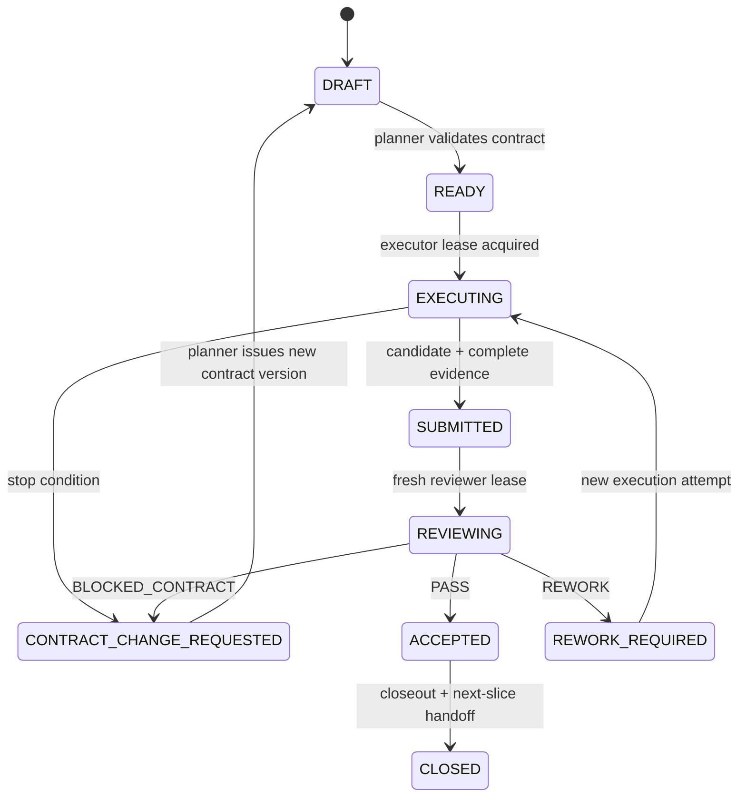

# Engineering Readiness and Phase/Slice Research

## Scope and verdict

This audit asks whether the repository is ready for the following engineering mode:

1. Codex plans the implementation as ordered **Phases** and independently reviewable **Slices**.
2. A separate execution Agent implements one approved Slice.
3. A fresh, read-only Codex reviewer evaluates the exact diff and evidence.
4. A failed review returns a precise rework request to the executor; a changed contract returns to planning.

The review covers every tracked Markdown design document in the repository as of 2026-08-05. It also checks the repository root and expected engineering directories. Research uses primary sources only: official Codex, OpenCode, LangGraph, GitHub, GitLab, Google engineering-practice documentation, and pinned upstream source.

**Verdict: the repository is architecture-ready for one more decision round, but not implementation-ready.**

The documents are unusually strong on domain language, state-machine authority, Git isolation, retry/recovery, evidence identity, approval boundaries, source updates, and the intended CI test layers. They are sufficient to prevent several foundational design mistakes.

They do not yet define an executable development system. In particular:

- ADR-0014 through ADR-0018 and their normative architecture package are still `proposed`;
- the concrete technology stack is explicitly deferred;
- there is no Phase/Slice planning and handoff protocol;
- there is no root or scoped `AGENTS.md`;
- there are no versioned Command, Event, Artifact, Evidence, Slice, or review Schemas;
- there is no implementation module/package layout or executable local development contract;
- CI is a policy document rather than runnable workflows and commands;
- threat modeling, observability, operator runbooks, Agent evaluation, and public-repository governance remain incomplete.

Production implementation should therefore not begin yet. A small documentation-and-scaffolding Phase 0 may begin after the current architecture proposal is approved.

## Local repository-state findings

Read-only inspection on 2026-08-05 found:

- the local repository has no initial commit, so every current document is untracked and no reviewable Base SHA exists;
- the local unborn branch is `master`, while the documented release model requires `main`;
- `origin` points to the public but empty `Frisk239/hermes-extention` repository;
- the repository and remote use `extention`, while the English word is `extension` and the installation document uses the product name `hermes-software-pipeline`;
- there is no root README, license, plugin manifest, plugin entry point, build manifest, lockfile, CI workflow, or Agent constitution;
- all pinned reference clones are ignored and clean.

Before the first Phase can use fixed-point review, the human must confirm the public repository/product name, choose `main`, and authorize an initial documentation baseline commit. Renaming before public consumers install the plugin is materially cheaper than preserving a misspelled installation path and package identity.

## Important vocabulary boundary

The repository must not overload its runtime Pipeline vocabulary:

- A runtime **Pipeline Stage** is a product-domain unit such as PRD, Architecture, Development, E2E, or Acceptance.
- An engineering **Phase** is a maintainer planning horizon that delivers one coherent repository capability.
- An engineering **Slice** is the smallest reviewable, test-backed repository increment inside a Phase.

Phase/Slice is the process used to build this plugin. Stage/Attempt/Run is the process the plugin implements. Mixing these two state systems would create ambiguous events, artifacts, dashboards, and review instructions.

## Primary-source findings

### 1. Agent instructions are useful context, not an execution protocol

Codex loads `AGENTS.md` guidance once per run, walks from the repository root toward the working directory, applies more local guidance later, and stops at the configured byte limit, which is 32 KiB by default. This supports a concise root contract plus narrowly scoped subtree guidance rather than one large role manual. [Codex AGENTS.md documentation](https://learn.chatgpt.com/docs/agent-configuration/agents-md)

The pinned Codex source implements this discovery and size cap in `reference/codex/codex-rs/core/src/agents_md.rs`. Codex's own repository `AGENTS.md` also provides a useful engineering precedent: it states exact build/test rules, integration-test expectations for agent logic, breaking-change surfaces, and change-size guidance rather than repeating product prose. [Codex repository AGENTS.md](https://github.com/openai/codex/blob/main/AGENTS.md)

OpenCode also loads committed project `AGENTS.md` guidance and can load additional instruction files through `opencode.json`. Its documentation recommends keeping `AGENTS.md` concise and using explicit instruction paths or globs for modular rules. [OpenCode rules](https://opencode.ai/docs/rules/)

Consequences for this project:

- `AGENTS.md` should route an Agent to authoritative documents and exact commands; it should not duplicate the entire architecture package.
- Role-specific context must be assembled as an immutable Execution Input, because directory-discovered instructions alone cannot bind a run to an exact Slice version, baseline SHA, evidence contract, or capability profile.
- Mandatory safety constraints must remain runtime-enforced. OpenCode permissions and Codex sandbox profiles demonstrate explicit filesystem/tool/command policy; neither product describes natural-language rules as a sandbox. [OpenCode permissions](https://opencode.ai/docs/permissions), [Codex sandboxing](https://learn.chatgpt.com/docs/sandboxing)

### 2. Planner-to-executor handoff should be structured and machine-validated

Codex non-interactive execution supports JSONL event output and a final output constrained by JSON Schema. The official guide identifies pipeline automation, explicit sandbox settings, and downstream machine-readable output as intended uses. [Codex non-interactive mode](https://learn.chatgpt.com/codex/non-interactive-mode)

OpenCode provides a headless server with an OpenAPI 3.1 contract, explicit sessions, messages, diffs, aborts, events, and asynchronous prompts. Its CLI also exposes raw JSON events for non-interactive runs. These are suitable Adapter surfaces, but the Controller still needs its own stable execution contract so an OpenCode release does not become the domain API. [OpenCode server](https://dev.opencode.ai/docs/server/), [OpenCode CLI](https://dev.opencode.ai/docs/cli/)

Consequences:

- Phase Plan, Slice Contract, Execution Report, Review Verdict, and Slice Closeout require versioned JSON Schemas.
- Markdown is a human-readable projection; the Controller should validate structured manifests.
- Each invocation must record the exact adapter/tool/model/version and raw execution identity.

### 3. A Slice should be one coherent, green, reviewable change

Google's engineering-practice guide defines a small change as one self-contained change with its related tests and enough context for review. It says small changes are reviewed more thoroughly, introduce fewer bugs, merge and roll back more easily, and should leave the system working. It also recommends separating large refactors from behavior changes and planning dependent changes before coding. [Small CLs](https://google.github.io/eng-practices/review/developer/small-cls.html)

This supports the following Slice rule:

> One Slice delivers one coherent behavioral or enabling outcome, includes its tests and documentation, leaves every mandatory check green, and can be accepted or reverted independently.

Line count may be a warning threshold, not the definition. A vertical Slice is preferred when it can demonstrate real behavior; a prerequisite contract, migration foundation, or test harness may be an enabling Slice if it is independently verifiable and used immediately by a following Slice.

### 4. Review must bind to a fixed diff, contract, and evidence set

Codex `/review` starts a dedicated reviewer, can review against a base branch or fixed changes, reports prioritized findings, and does not change the working tree. [Codex code review](https://learn.chatgpt.com/codex/code-review)

GitHub PRs expose the exact diff, checks, findings, review discussion, and merge blockers; draft PRs distinguish work in progress from formal review. [GitHub pull requests](https://docs.github.com/en/pull-requests/reference/pull-requests) GitHub issue and PR templates standardize the information required from authors. [GitHub issue and PR templates](https://docs.github.com/en/communities/using-templates-to-encourage-useful-issues-and-pull-requests/about-issue-and-pull-request-templates)

Google's reviewer guide recommends first checking whether the change and its description make sense, then examining the main design, then the remaining files; it explicitly allows requesting a split when the change is too large to reason about. [Navigating a change](https://google.github.io/eng-practices/review/reviewer/navigate.html) Its review standard asks whether the change improves overall code health, rather than demanding subjective perfection. [Code review standard](https://google.github.io/eng-practices/review/reviewer/standard.html)

Consequences:

- Review begins only after the executor freezes a Candidate SHA and submits a complete Evidence Bundle.
- The reviewer is fresh, read-only, and receives the original Slice Contract, exact base/Candidate SHAs, diff, evidence, and active standards.
- Review output is typed as `PASS`, `REWORK`, or `BLOCKED_CONTRACT`, with severity, evidence, file/line when applicable, violated criterion, and required outcome.
- `REWORK` preserves the same Slice contract and creates a new execution/review attempt.
- `BLOCKED_CONTRACT` returns to the planner and produces a new version or replacement Slice; the reviewer must not silently redesign the work.
- Review comments should explain why and distinguish blockers from optional nits. [Google review comments](https://google.github.io/eng-practices/review/reviewer/comments.html)

### 5. LangGraph can coordinate a Slice run, but cannot define its acceptance

LangGraph describes itself as low-level infrastructure for long-running, stateful Agent workflows with durable execution and human-in-the-loop support. [LangGraph overview](https://docs.langchain.com/oss/python/langgraph/overview)

On interrupt resume, LangGraph restarts the node from its beginning, and side effects before an interrupt must be idempotent. Its Functional API likewise says a task may execute again if it started but did not complete. [LangGraph interrupts](https://docs.langchain.com/oss/python/langgraph/interrupts), [LangGraph Functional API](https://docs.langchain.com/oss/python/langgraph/functional-api)

This confirms the existing architectural decision:

- LangGraph may implement the planner/executor/reviewer run orchestration and checkpointing.
- The Controller owns Slice status, attempt identity, accepted evidence, and verdict.
- Every graph-to-Controller submission uses a stable command/idempotency identity.
- A LangGraph checkpoint is not proof that code, tests, artifacts, or review actually completed.

### 6. Agent behavior itself requires evaluation, not just code tests

LangSmith's official evaluation model distinguishes offline evaluation against curated datasets from online evaluation on production traces. It supports human, code, LLM-as-judge, and pairwise evaluators, including trajectory evaluation of Agent tool use. [LangSmith evaluation](https://docs.langchain.com/langsmith/evaluation), [evaluation concepts](https://docs.langchain.com/langsmith/evaluation-concepts)

LangSmith is not required as the product choice. The design implication is vendor-neutral:

- prompt, model, tool, policy, and graph changes require a versioned regression corpus;
- critical cases must score both final output and trajectory/permission behavior;
- a real-Agent smoke test alone is too narrow and too expensive to be the only Agent quality signal.

### 7. Public distribution adds repository-governance obligations

GitHub's public-repository community profile checks for README, LICENSE, CONTRIBUTING, CODE_OF_CONDUCT, issue templates, and a security policy. [GitHub community profile](https://docs.github.com/en/communities/setting-up-your-project-for-healthy-contributions/about-community-profiles-for-public-repositories) Contribution guidelines are surfaced to issue and PR authors and are intended to reduce malformed submissions. [GitHub contributing guidelines](https://docs.github.com/en/communities/setting-up-your-project-for-healthy-contributions/setting-guidelines-for-repository-contributors)

GitHub recommends least-privilege workflow token permissions. [GitHub Actions token security](https://docs.github.com/actions/how-tos/security-for-github-actions/security-guides/automatic-token-authentication) Artifact attestations can bind build provenance to the repository, workflow, commit SHA, and trigger. [GitHub artifact attestations](https://docs.github.com/en/actions/how-tos/secure-your-work/use-artifact-attestations/use-artifact-attestations)

The existing signed-release and SBOM intent is directionally correct, but a shareable repository still needs the actual governance files, workflow permissions, release automation, and provenance verification.

## Current repository coverage matrix

Legend:

- **Covered**: sufficiently decided to constrain downstream design.
- **Partial**: strong principles exist, but executable detail or approval is missing.
- **Missing**: no normative implementation guidance exists.

| Area | Status | Current evidence | Concrete gap before implementation |
| --- | --- | --- | --- |
| Product purpose and runtime Pipeline | Covered | `CONTEXT.md`; `pipeline-state-machine.md` | Approve the finalized proposal; correct text-encoding artifacts before using it as generated context |
| Domain vocabulary | Covered | `CONTEXT.md` has precise avoided synonyms and source identities | Add Phase/Slice vocabulary without colliding with Stage/Attempt/Run |
| Controller authority and durable protocol | Partial | `controller-and-execution-architecture.md`; ADR-0014 | ADR remains proposed; Command/Event catalog, error codes, transaction boundaries, projection schemas, upcasters, and reconciliation algorithms are not versioned contracts |
| Runtime Pipeline state machine | Partial | Complete conceptual Mermaid and invariants | No machine-readable transition table, guard/action definitions, event mapping, or generated invariant tests |
| Retry, lease, fencing, pause/cancel | Partial | Strong normative behavior | No lease timing policy, clock model, retry budgets, terminal error catalog, or persisted Schema |
| Agent runtime capability model | Partial | Profiles and fail-closed principle; ADR-0015 | No selected sandbox implementation, OS parity decision, executable policies, capability test suite, or threat model |
| Artifact and evidence model | Partial | Manifest fields and Evidence Bundles; ADR-0016 | No JSON Schemas, storage backend, canonicalization/hash rules, retention defaults, redaction/export/deletion procedure, or size limits |
| Git/worktree protection | Partial | Strong authority matrix and recovery invariants | Branch naming, submodule/LFS/sparse/large-repo behavior, retention, cleanup, commit author convention, and first provider remain open |
| Remote delivery and merge authority | Partial | Clear least-privilege seam; ADR-0017 | GitHub versus GitLab is undecided; no Adapter API, webhook Schema, GitHub App permission manifest, provider conformance fixtures, or merge-queue test environment |
| Planning/integration baselines | Partial | Strong four-SHA model; ADR-0018 | ADR remains proposed; “material semantic conflict” detector and Project policy inputs are not specified |
| Human approval and Feishu flow | Partial | Authority and durable feedback are well defined | No Feishu app permission model, callback verification/replay contract, card versioning, fallback channel, notification privacy rules, or UX specification |
| Source install and safe update | Partial | Detailed eligibility, drain, migration, rollback policy | Exact Hermes extension API/version contract is not proven; updater packaging/service management/Windows behavior and uninstall/backup-restore runbooks are not designed |
| CI and test strategy | Partial | Excellent test-layer and failure-scenario inventory | No `pyproject.toml`, lockfile, actual commands, fixtures, coverage policy, workflow files, branch protection rules, cache policy, test ownership, or expected-duration budgets |
| Release policy | Partial | Branch/channel/version/update rules, signed tag, SBOM intent | No changelog/deprecation/support policy, release tooling, provenance verification, release ownership, or emergency release procedure |
| Phase/Slice planning | Missing | No document or Schema | Define hierarchy, identifiers, dependencies, entry/exit criteria, vertical-slice rule, WIP limit, risk class, and plan revision rules |
| Planner/executor/reviewer protocol | Missing | Runtime Agent roles are described, not the repository-building workflow | Define role authority, fresh-session rules, context manifests, handoff artifacts, verdicts, rework loop, and contract-change escalation |
| Role context and `AGENTS.md` | Missing | No `AGENTS.md` exists | Add concise root instructions, scoped implementation/test/docs guidance, and generated per-run role context |
| Implementation architecture | Missing | Interfaces are named at a conceptual level | Define process/container topology, package/module tree, dependency direction, public Interfaces, ownership, failure boundaries, and forbidden imports |
| Technology stack | Missing | Python 3.11–3.13 CI is stated; LangGraph is only conditional | Decide runtime language/package manager, Controller framework, database, migration tool, checkpointer, queue/outbox dispatcher, sandbox, Artifact Store, UI, observability, provider, deployment topology, and version pins |
| Dependency and build reproducibility | Missing | A “standard-library Hermes entry” constraint is stated | Resolve how LangGraph and other runtime dependencies are installed/isolation-managed; add lockfiles, reproducible build, supply-chain policy, and upgrade process |
| API and Schema governance | Missing | Schema versions are mentioned | Establish source directories, naming, code generation/validation, compatibility rules, deprecation, examples, and golden tests |
| Engineering conventions | Missing | Broad Definition of Done only | Exact format/lint/type/test commands, naming, errors, async/concurrency, logging, configuration, database, migration, test-fixture, and documentation rules |
| Security engineering | Partial | Least privilege and adversarial cases are strong | Add assets/trust boundaries/threats/mitigations, secret lifecycle, dependency policy, vulnerability response, privacy/data classification, audit access, and security ownership |
| Observability and operations | Missing | Logs directory and reconciliation are mentioned | Define structured logs, traces, metrics, correlation IDs, health/readiness, SLOs, alerts, dashboards, audit querying, backup restore, incident and disaster-recovery runbooks |
| Agent/model evaluation | Missing | Real-Agent smoke test is proposed | Add curated regression cases, golden structured outputs, trajectory/permission graders, model/prompt/graph version comparison, cost/latency thresholds, quarantine, and promotion rules |
| Public project governance | Missing | Repository is intended to be shared | Add README, LICENSE, CONTRIBUTING, SECURITY, SUPPORT, CODE_OF_CONDUCT, governance/maintainer policy, issue/PR templates, and roadmap |

## Required Phase/Slice engineering protocol

### Phase Plan

A Phase is approved before any of its implementation Slices are dispatched. Its immutable version must contain:

- `phase_id`, title, owner, version, status, and Planning Base SHA;
- one demonstrable business or engineering outcome;
- scope and explicit non-goals;
- architectural decisions and accepted ADR versions it relies on;
- ordered Slice dependency DAG;
- Phase entry criteria;
- Phase exit criteria and a runnable demonstration;
- security, migration, compatibility, and release posture;
- Phase-level risks and rollback/abandonment strategy;
- expected documentation and operator impact;
- resource/cost/time envelope.

The planner may refine future unstarted Slices without invalidating accepted Slices, but may not rewrite history. A changed dependency, interface, or acceptance contract creates a new Phase Plan version and identifies exactly which pending or active Slices are invalidated.

### Slice Contract

Every Slice needs one immutable, machine-validated contract:

```yaml
schema_version: 1
slice_id: P01-S03
phase_id: P01
contract_version: 2
base_sha: "<full SHA>"
goal: "One observable, reviewable outcome"
non_goals: []
depends_on: ["P01-S02"]
architecture_refs: []
allowed_paths: []
forbidden_paths: []
interfaces_changed: []
acceptance_criteria: []
required_tests:
  - command: "<exact deterministic command>"
    expected: "<machine-verifiable outcome>"
required_evidence: []
capability_profile: "development-workspace@v1"
risk_class: "normal"
rollback: "<revert or disable strategy>"
change_budget:
  expected_files: 0
  soft_diff_lines: 0
stop_conditions: []
```

Normative Slice rules:

1. One coherent outcome, not “work on subsystem X”.
2. Acceptance is observable and testable; vague criteria such as “works correctly” are invalid.
3. Tests and user/operator documentation ship in the same Slice when behavior changes.
4. The repository is green after every accepted Slice.
5. Refactoring and behavior change are separated unless inseparable and explicitly justified.
6. The executor cannot widen scope, dependencies, permissions, public API, migrations, or architecture.
7. A soft size budget triggers replanning discussion; it is not an incentive to hide or compress necessary code.
8. A Slice that cannot be independently reviewed should be split before execution.

### Executor input and output

The executor receives a generated Context Manifest rather than the entire repository documentation set:

- exact Slice Contract and Phase Plan version;
- base SHA and assigned Managed Worktree;
- root and applicable scoped `AGENTS.md`;
- only relevant accepted ADR/design sections;
- interface/Schemas it may consume or change;
- previous Slice Closeout when a dependency exists;
- capability profile and prohibited operations;
- exact validation commands and expected evidence;
- unresolved but non-blocking assumptions.

The executor uses a fresh session per Slice Attempt. It returns an Execution Report containing:

- Slice/contract/base/Candidate identities;
- concise implementation summary;
- changed files and public/interface changes;
- exact commands, exit codes, test counts, durations, and artifact hashes;
- acceptance-criterion-to-evidence mapping;
- deviations and discovered risks;
- dependency/configuration/migration changes;
- residual limitations and rollback notes;
- raw Agent execution identity and version provenance.

The executor must stop and submit a Contract Change Request instead of improvising when:

- an acceptance criterion is contradictory or impossible;
- an unlisted public interface, migration, secret, permission, or external side effect is required;
- the base no longer matches a required assumption;
- the Slice cannot remain independently green;
- the change exceeds its architecture or risk class.

### Reviewer input and verdict

The reviewer starts a fresh read-only Codex session and receives:

- exact Slice Contract and active standards;
- Phase goal and relevant accepted architecture;
- base and Candidate SHAs;
- full diff and changed-file inventory;
- Execution Report and independently retrievable Evidence Bundle;
- CI results and any prior rework findings.

Review has two axes:

1. **Specification:** every acceptance criterion, non-goal, boundary, and required evidence item.
2. **Standards:** architecture, security, correctness, tests, maintainability, compatibility, migrations, documentation, and repository rules.

The typed verdict is:

- `PASS`: all blockers satisfied; optional nits are explicitly non-blocking.
- `REWORK`: the contract remains valid, but implementation/evidence has correctable defects.
- `BLOCKED_CONTRACT`: implementation cannot be judged or completed without changing the approved contract.

Every finding contains:

- stable finding ID and severity;
- violated criterion, standard, or invariant;
- concrete evidence and tight source location when applicable;
- impact/risk;
- required outcome, not a replacement implementation;
- whether it blocks Slice acceptance.

The reviewer never edits the executor's work. A rework attempt receives the unchanged contract plus exact unresolved findings. Review must verify that fixes did not create unrelated changes and that all previously passing evidence still binds to the new Candidate.

### Slice state model



No state is inferred from chat completion. Every transition references the relevant manifest, Candidate SHA, evidence, verdict, and actor/run identity.

### Phase exit

A Phase closes only when:

- every required Slice is accepted and closed;
- the integrated Phase head passes all Phase exit checks;
- the Phase demo succeeds from a clean environment;
- architecture, Schemas, user/operator documentation, and changelog are current;
- security/migration/compatibility evidence required by the Phase is present;
- residual risks and deferred work are explicit;
- a Phase Closeout records the integration SHA and seeds the next Phase Plan.

## Recommended engineering document set before coding

### P0 — Blocking

1. Accept, amend, or reject ADR-0014 through ADR-0018 and the architecture package.
2. `docs/engineering/phase-slice-protocol.md` plus JSON Schemas for Phase Plan, Slice Contract, Execution Report, Review Verdict, Contract Change Request, and Closeout.
3. `docs/architecture/system-and-module-design.md` with process topology, module tree, Interfaces, dependency rules, and ownership.
4. `docs/architecture/data-and-api-contracts.md` plus initial machine-readable Command/Event/projection/artifact/evidence Schemas.
5. Technology ADR set covering the complete v1 stack and version/upgrade policy.
6. Root `AGENTS.md`, scoped `AGENTS.md` files where needed, executor/reviewer role templates, and Context Manifest assembly rules.
7. `CONTRIBUTING.md` or `docs/development/engineering-standard.md` with exact local commands and change conventions.
8. `docs/security/threat-model.md` and initial enforceable runtime capability policies.
9. An executable Phase 0 Plan broken into reviewable Slices.

### P1 — Required before behavior-bearing Slices

1. Actual `pyproject.toml`, dependency lock, test/lint/type configuration, and reproducible bootstrap.
2. Executable CI workflows and protected-branch configuration.
3. Adapter conformance harnesses for Hermes, Codex, OpenCode, persistence, and the first Git provider.
4. Agent evaluation corpus and promotion thresholds.
5. Observability contract and local operator runbooks for start/stop/backup/restore/reconcile.
6. Migration and compatibility test fixtures.

### P2 — Required before public preview

1. README, LICENSE, SECURITY, SUPPORT, CODE_OF_CONDUCT, GOVERNANCE, issue forms, and PR template.
2. Release automation, changelog/deprecation/support policy, signed provenance, and installation verification.
3. Feishu integration security/UX contract and fallback operation.
4. Incident response, disaster recovery, data retention/export/deletion, and vulnerability disclosure.
5. Multi-OS installation, upgrade, rollback, and real-Agent release-candidate evidence.

## Technology-stack status

The technology stack is **not decided**.

What is currently constrained:

- Python 3.11, 3.12, and 3.13 are named as the CI matrix.
- The Hermes-loaded entry point is expected to use only the standard library and Hermes-guaranteed dependencies.
- LangGraph is a candidate for the replaceable Stage Executor.
- The Controller must retain a separate Event Log and business authority.

What remains explicitly open:

- Python packaging and dependency isolation;
- in-process versus separate Controller service;
- web/API framework;
- Controller database and migration library;
- Outbox dispatcher/queue;
- LangGraph Graph versus Functional API and graph composition;
- durable checkpointer;
- sandbox/process/container implementation on Windows and Linux;
- Artifact Store;
- Dashboard stack;
- observability and Agent evaluation stack;
- GitHub or GitLab first;
- Feishu SDK/transport;
- service management and deployment topology.

There is also a concrete unresolved packaging tension: LangGraph is a runtime dependency, while the current standard says the Hermes-loaded plugin entry may depend only on the standard library and Hermes-guaranteed packages. The technology design must choose one of these patterns:

1. a thin standard-library Hermes shim that supervises a separately bootstrapped, locked Python environment and Controller service;
2. an explicit Hermes-supported plugin dependency-installation contract;
3. a packaged standalone runtime artifact invoked by the plugin.

Silently importing LangGraph from the Hermes process without a reproducible installation and isolation contract would violate the existing engineering standard.

## Proposed first implementation roadmap shape

This is not yet the final Phase Plan; it shows the dependency order that the future planner should formalize.

| Phase | Demonstrable exit | Example Slice sequence |
| --- | --- | --- |
| Phase 0 — Engineering contract | A clean clone can validate all planning/review Schemas and run exact repo checks | governance files → stack ADRs → package/module skeleton → Schemas → AGENTS/context compiler → CI bootstrap |
| Phase 1 — Deterministic Controller kernel | Commands produce deduplicated Events/projections/Outbox effects and survive restart | domain types → event store → command transaction → projection rebuild → outbox → lease/fencing |
| Phase 2 — Local execution substrate | A fake then one real CLI Stage runs under an enforced capability profile and returns verified artifacts | runtime broker → artifact store → fake executor → capability enforcement → Codex adapter → OpenCode adapter |
| Phase 3 — Planning and development flow | Confirmed requirement reaches an immutable local Candidate through PRD, Architecture, approval, Development, and self-test | PRD → Architecture/questions → approval → worktree → Development → Candidate |
| Phase 4 — Independent verification | Exact Integration Candidate passes isolated E2E and Codex Acceptance or returns deterministic rework | delivery fake → integration builder → Chrome E2E → Acceptance → drift revalidation |
| Phase 5 — Team and provider integration | Authenticated team roles, Feishu decisions, and one protected Git provider complete the Pipeline | identity/RBAC → Feishu → GitHub or GitLab App → webhook reconciliation → native merge authority |
| Phase 6 — Operations and release | Source install, upgrade, rollback, observability, recovery, and signed public preview work on Windows and Linux | setup/doctor → service lifecycle → backup/migrate → update/rollback → dashboards/alerts → release provenance |

Every Phase should start with deterministic fakes and contract tests, then add the real Adapter in a later Slice. This keeps Controller behavior reviewable without paid models or external systems and matches the current CI policy.

## Final readiness gate

The project may begin behavior-bearing implementation only when all of the following are true:

- the normative architecture and ADR statuses are accepted;
- the v1 technology stack and dependency/deployment model are accepted;
- Phase/Slice Schemas and the planner/executor/reviewer protocol validate in CI;
- Phase 0 has an approved, versioned Plan and every Slice has explicit evidence;
- root/scoped Agent instructions and generated Context Manifests exist;
- exact bootstrap, format, lint, type, unit, and Schema-validation commands work from a clean clone;
- the initial module layout and dependency rules exist;
- the Command/Event/Artifact/Evidence contracts needed by the first Controller Slice are versioned;
- threat model and capability enforcement choice cover the first Slice;
- an independent reviewer can reproduce a complete fake Slice handoff and issue a typed verdict.

Until then, additional application code would force the executor to invent architecture, tools, conventions, and acceptance rules during implementation—the opposite of the proposed planner/executor/reviewer model.
