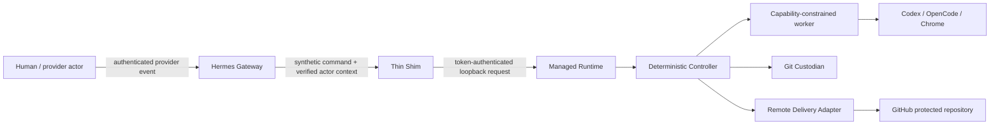

# Threat Model and Trust Boundaries

This document defines the version 1 security model. Agent output, chat content, repository content, browser content, provider callbacks, and model-generated tool arguments are untrusted.

## Protected assets

- Project source and Git history;
- Workspace and Project identity, membership, and approvals;
- Controller Event Log, approval attestations, and audit history;
- provider, model, repository, and browser credentials;
- immutable artifacts and evidence;
- user working copies and unrelated filesystem content;
- host process integrity and availability.

## Trust boundaries

Crossing a boundary requires validation, authentication where applicable, authorization, size limits, idempotency, safe logging, and a typed result. Natural-language instructions never carry authority across a boundary.

## Principal assumptions

- The Host Operator controls the machine and can ultimately access local data. Version 1 does not defend against a malicious host administrator.
- Hermes core and the installed plugin loader are trusted dependencies, but Hermes conversations and Agent output are untrusted inputs.
- Codex and OpenCode may be incorrect, prompt-injected, or compromised. They receive capabilities, not ambient authority.
- Project repositories may contain malicious instructions, symlinks, hooks, build scripts, and test code.
- GitHub and Feishu actor identity is trusted only after verification by the owning Adapter.
- Browser pages are hostile. Browser output cannot issue Controller Commands directly.

## Authorization invariants

1. Workspace membership grants no Project access.
2. Workspace Administrator grants governance authority, not implicit Project content access.
3. Project roles are evaluated by the Controller against durable membership and policy versions.
4. Approval requires an authenticated eligible human and binds an exact artifact set or Git head.
5. Prod Main cannot approve, merge, grant roles, alter policy, or self-assert identity.
6. Agents cannot mutate authoritative Pipeline state, Git history, remote branches, approval records, or credentials.
7. The Remote Delivery Adapter can publish and reconcile only its Project namespace; it cannot approve, merge, or bypass protection.
8. Stale expected revisions, stale approval targets, and stale lease generations fail closed.

## Agent capability matrix

| Capability | Codex PRD | Codex Architecture | OpenCode Development | OpenCode E2E | Codex Acceptance |
| --- | --- | --- | --- | --- | --- |
| Project source read | yes | yes | yes | exact Candidate only | exact baseline and Candidate |
| Managed source write | no | no | yes, assigned worktree | no | no |
| Artifact write | assigned output only | assigned output only | assigned output only | evidence only | verdict/evidence only |
| Network | deny by default | deny by default | deny or allow-list | local app plus approved test endpoints | deny by default |
| Browser | none | none | none | Chrome DevTools MCP | none |
| Secrets | none by default | none | named build/test secrets only | named test secrets only | none |
| Git mutation | never | never | never | never | never |
| Remote credentials | never | never | never | never | never |

Capability Profiles further narrow this matrix per Project and Run.

## Repository defenses

- Resolve and validate every repository, common Git dir, worktree, artifact, and temporary path before mutation.
- Reject symlink, junction, reparse-point, submodule, or case-folding escapes outside authorized roots.
- Disable repository hooks for controlled Git operations and set an explicit safe configuration.
- Never load executable configuration from an untrusted branch before policy allows it.
- Agents receive no Git credential helper and no provider token.
- Candidate creation validates path scope, forbidden files, secrets, generated evidence, and dirty/untracked state.
- The Controller records exact Base and Candidate SHAs. Branch names are never evidence.
- Cleanup acts only on Controller-owned paths with ownership markers and validated roots.

## Process and command defenses

- Runtime Broker accepts typed executable identifiers and argument arrays, never arbitrary shell strings.
- Executables resolve from administrator-configured absolute paths and verified versions.
- Environment starts from an allow-list; inherited secrets and credential variables are removed.
- Every Run has wall-time, output-size, process-count, and cancellation limits.
- Process trees are killed as a unit on expiry or cancellation.
- stdout and stderr are streamed through redaction and stored as bounded artifacts.
- Windows Job Objects and Linux process groups/cgroups are the preferred enforcement Adapters; Phase 0 must prove actual platform behavior.

## Loopback Interface defenses

- Bind only to `127.0.0.1` and `::1`; never wildcard interfaces.
- Generate a random port and a high-entropy bearer token per runtime start.
- Store the descriptor in a user-only directory with restrictive ACL/mode and PID/start-time metadata.
- Reject Host headers and origins not matching loopback policy.
- Rate-limit commands and cap request size.
- Rotate the token on every restart; remove stale descriptors safely.
- Treat local malware as outside the v1 defense boundary, but prevent accidental cross-user access.

## Secrets

- Configuration references secret identifiers, never plaintext values.
- A Secret Provider Interface resolves values just-in-time for an authorized Run or Adapter.
- Prefer Windows Credential Manager/DPAPI and OS keyring-backed stores; environment variables are a development fallback only.
- Secrets are scoped by Workspace, Project, purpose, and capability profile.
- Values are never persisted in Event payloads, checkpoints, manifests, prompts, or CLI arguments.
- Redaction uses exact canaries plus provider-specific patterns; CI exercises leakage tests.
- Rotation invalidates affected leases and provider sessions without rewriting history.

## Prompt injection controls

- Repository files, PR comments, issue text, Feishu messages, web pages, and tool output are labeled untrusted context.
- System role contracts and machine-enforced capabilities are not modifiable by content.
- Agents cannot request additional tools by emitting text.
- Human-facing questions quote only minimal source context and never include executable hidden content.
- A model recommendation is evidence for a human or deterministic Gate; it is never authorization.

## Supply chain

- Python dependencies are fully locked with hashes and updated through reviewed automation.
- Releases produce an SBOM, provenance, checksums, and signed tags/artifacts.
- Hermes compatibility is tested against a declared version range.
- Update installation occurs outside the running process, stages a candidate, verifies it, and preserves Last Known Good.
- No install or update script executes code from an unverified moving branch.

## Required security tests

- authorization decision-table tests for every command;
- stale revision, stale lease, duplicate callback, and replay tests;
- path traversal, symlink/junction, case collision, and malicious Git configuration tests;
- secret canary tests across logs, artifacts, Events, errors, and prompts;
- command argument injection and environment inheritance tests;
- hostile repository and hostile browser-content scenarios;
- approval-target substitution and provider-identity mismatch tests;
- update signature, rollback, and migration failure tests.

## Deferred boundaries

Version 1 does not promise:

- hard multi-tenant isolation on one hostile host;
- containment of arbitrary native code equivalent to a VM sandbox;
- webhook-only operation behind NAT;
- fully automatic merging or deployment;
- defense against an administrator with direct database and filesystem access.

These limits must be visible in installation and operator documentation.

